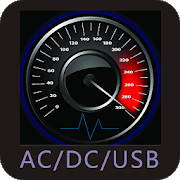
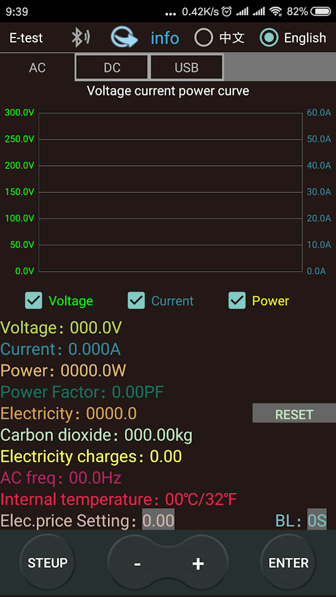

# E-test

E-test is an APP that can view the running status of the electric energy meter in real time, and record the status of voltage, current and power in the form of a curve.

# Table of contents
- [Links](#links)
- [Setup bluetooth](#setup-bluetooth)
- [Screenshot](#screenshot)

## Links
[Android official link](https://play.google.com/store/apps/details?id=com.tang.etest.e_test)
[iOS official link](https://apps.apple.com/app/e-test/id1478623332)
[Android and PC software](http://www.mediafire.com/folder/31bc15uhq8odb/E-meter)

## Setup bluetooth

## Screenshot

