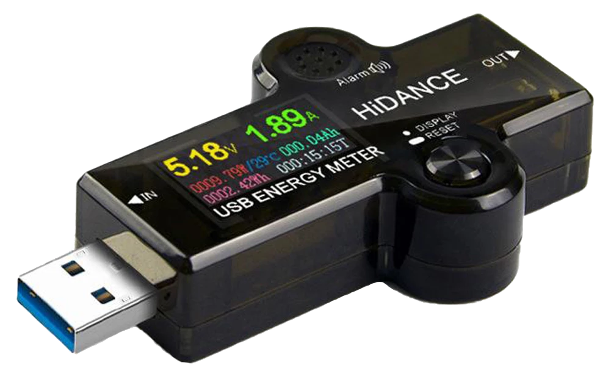
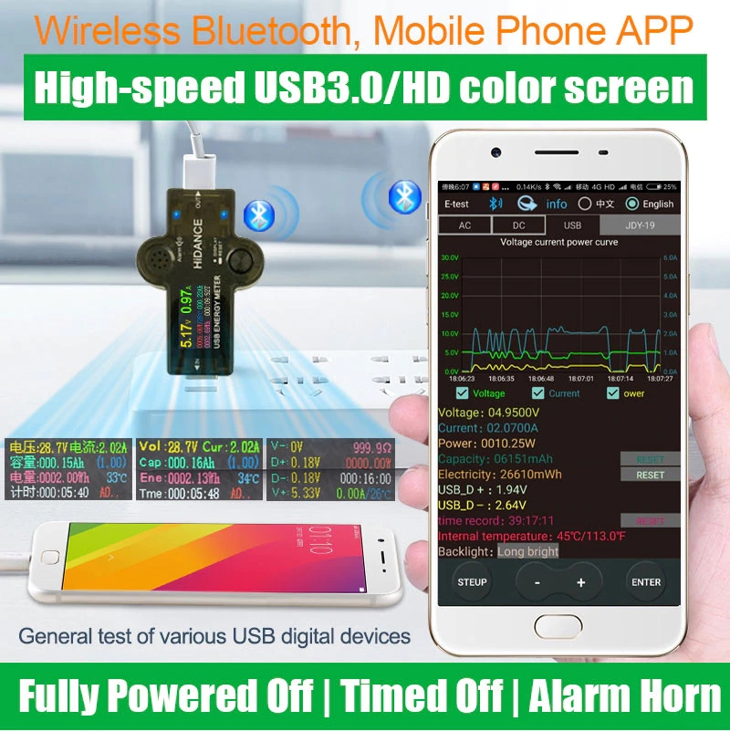
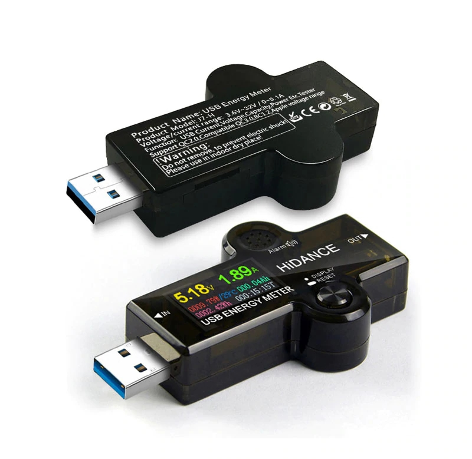
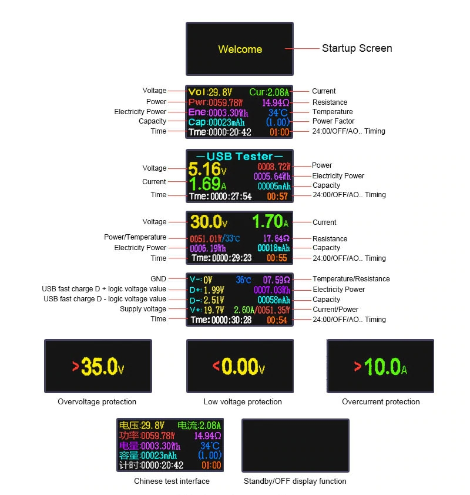
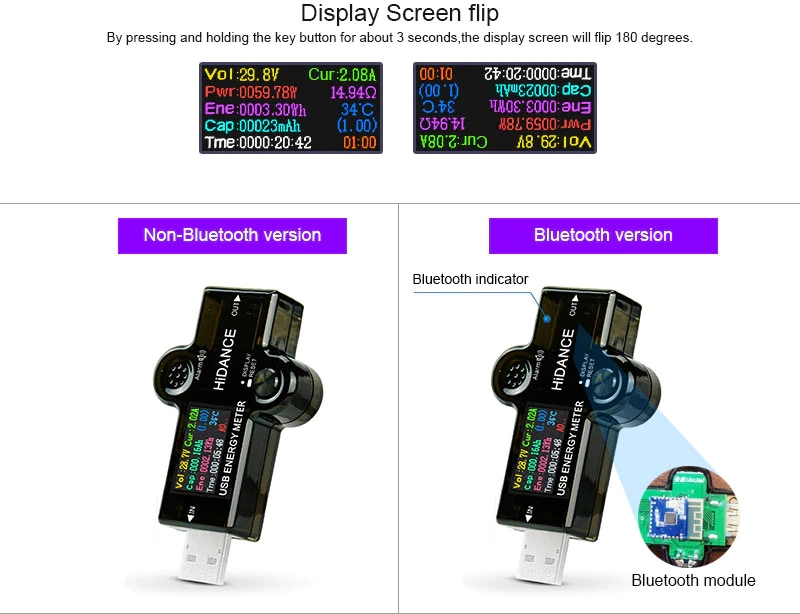
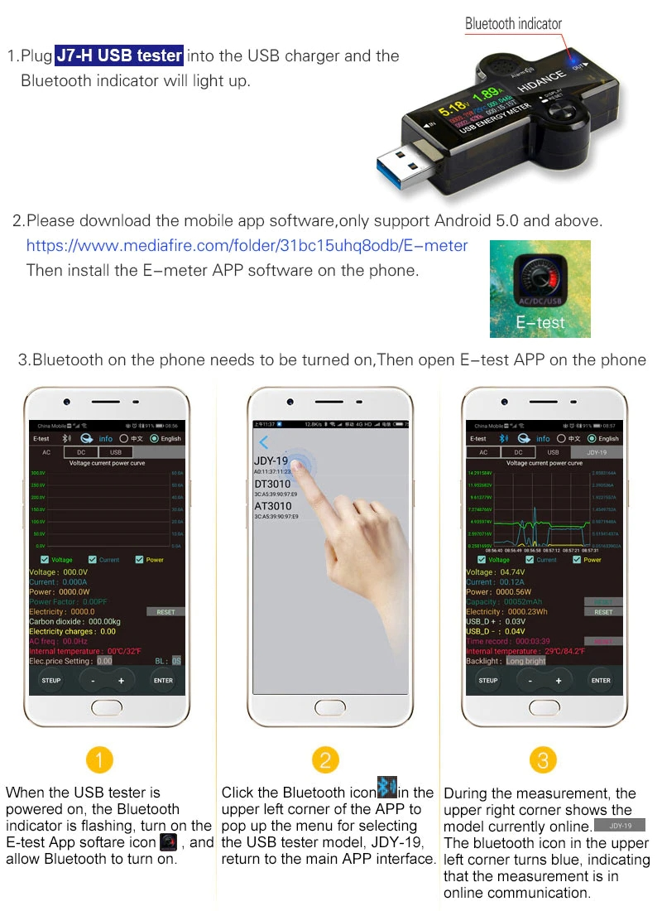
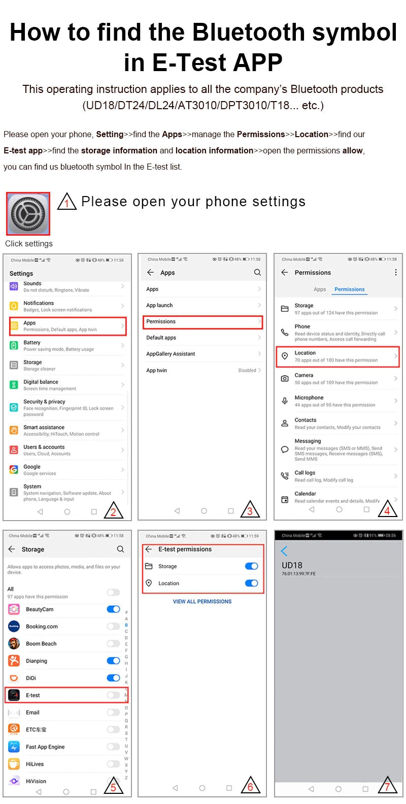

# HiDANCE J7-H USB Energy Meter

# Table of contents
- [Production Description](#production-description)
- [Product Details:](#product-details)
- [KEY Button Description](#key-button-description)
- [Software download address](#software-download-address)
- [SDK](#sdk)
			- [Record structure:](#record-structure)
			- [Commands](#commands)
			- [Data formats](#data-formats)
- [Images](#images)

## Production Description
Measurement Ranges (and resolution accuracy):
- Voltage: 3.60 - 32.0 V (0.01 V)
- Current: 0.00 - 5.00 A (0.01 A)
- Capacity accumulation: 0 - 99999 mAh (0.001 Ah)
- Power accumulation: 0 - 9999.99 Wh (0.01 Wh)
- Power calculation: 0.00 - 160.00 W (0.01 W)
- Impedance: 0.0 - 6000.0 Ω (0.1 Ω)
- Temperature: 0 - 100 ºC (1 ºC)
- Timing time: 999:59:59 (1 s)
- USB D+ voltage: 0 - 3.30 V (0.01 V)
- USB D- voltage: 0 - 3.30 V (0.01 V)

[TOC](#table-of-contents)

## Product Details:
- Input Interface:  USB
- Output interface:  USB
- Timed charge reminder settings: 24-hour countdown
- Full charge threshold parameters: < 2 W / 0.5 hours
- Refresh time: > 500ms / time
- Measurement rate: about 0.5 time / s
- Alarm mode: siren sound
- Display type: IPS Color Screen
- Product dimensions: 76 x 30.5 x 15.6 mm
- Current consumption: < 0.02 A
- Operating temperature: -10 to +60 ºC
- Working humidity: 10 to 80 (no doubt)
- Work oppression: 80 - 106 Kpa

[TOC](#table-of-contents)

## KEY Button Description
1. Long press the key button to flip the screen (180 degree flip)
2. Double-click the capacity(Ah) to clear zero.
3. Three-click the Quantity of electric charge(Wh) is clear zero.
4. Four-click time is clear zero.
5. Five-click timing settings.

Switch between different display interfaces by clicking the button

[TOC](#table-of-contents)

## Software download address
[E-test](../E-test)

- [iOS Official App](https://apps.apple.com/app/e-test/id1478623332): search E_test on iPhone App Store
- [Android Official App](https://play.google.com/store/apps/details?id=com.tang.etest.e_test): search E-test at Google Play

[TOC](#table-of-contents)

## SDK

##### Record structure:

| Offset | Meaning                 | Scale Unit | Data format    | Stored |
|--------|-------------------------|------------|----------------|:------:|
| 0000h  | Data mark (0xFF550103)  |            | char[4]        |        |
| 0004h  | reserved                |            | char           |        |
| 0005h  | V+                      | 1/100 V    | unsigned word  |        |
| 0007h  | V-                      | 1/100 V    | unsigned char  |        |
| 0008h  | Current (I)             | 1/100 A    | unsigned word  |        |
| 000Ah  | reserved                |            | char           |        |
| 000Bh  | Capacity                | 1 mAh      | unsigned word  |  Yes   |
| 000Dh  | Energy                  | 1/100 Wh   | unsigned dword |  Yes   |
| 0011h  | D-                      | 1/100 V    | unsigned word  |        |
| 0013h  | D+                      | 1/100 V    | unsigned word  |        |
| 0015h  | Temp                    | 1 ºC       | unsigned word  |        |
| 0017h  | Hours                   | 1 h        | unsigned word  |  Yes   |
| 0019h  | Minuts                  | 1 min      | unsigned char  |  Yes   |
| 001Ah  | Seconds                 | 1 s        | unsigned char  |        |
| 001Bh  | Back Light (BL)         | 1 s        | unsigned char  |  Yes   |
| 001Ch  | Overvoltage alarm (V>)  | 1/100 V    | unsigned word  |  Yes   |
| 001Eh  | Undervoltage alarm (V<) | 1/100 V    | unsigned word  |  Yes   |
| 0020h  | Overcurrent alarm (I>)  | 1/100 A    | unsigned word  |  Yes   |
| 0022h  | Power Factor            | 1/100      | unsigned char  |        |
| 0023h  | reserved                |            | char           |        |

[TOC](#table-of-contents)

##### Commands
| Command        | Send                          | Receive                 |
|----------------|-------------------------------|-------------------------|
| Electric Reset | FF 55 11 03 01 00 00 00 00 51 | FF 55 02 03 01 00 00 42 |
| Capacity Reset | FF 55 11 03 02 00 00 00 00 52 | FF 55 02 03 01 00 00 42 |
| Time Reset     | FF 55 11 03 03 00 00 00 00 53 | FF 55 02 03 01 00 00 42 |
| All Reset      | FF 55 11 03 05 00 00 00 00 5D | FF 55 02 03 01 00 00 42 |
| Setup          | FF 55 11 03 31 00 00 00 00 01 | FF 55 02 03 03 00 00 4C |
| Enter          | FF 55 11 03 32 00 00 00 00 02 | FF 55 02 03 03 00 00 4C |
| +              | FF 55 11 03 33 00 00 00 00 03 | FF 55 02 03 01 00 00 42 |
| -              | FF 55 11 03 34 00 00 00 00 0C | FF 55 02 03 01 00 00 42 |

[TOC](#table-of-contents)

##### Data formats

| Data format | Lenght  | Byte order |
|-------------|--------:|------------|
| char        |  8 bits |            |
| word        | 16 bits | Big endian |
| dword       | 32 bits | Big endian |

[TOC](#table-of-contents)

## Images

[TOC](#table-of-contents)

[TOC](#table-of-contents)

[TOC](#table-of-contents)

[TOC](#table-of-contents)

[TOC](#table-of-contents)

[TOC](#table-of-contents)
