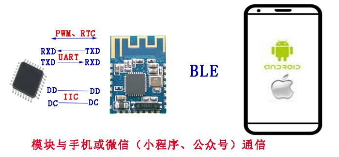
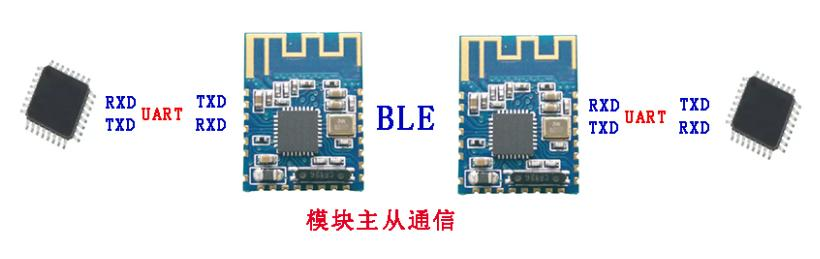
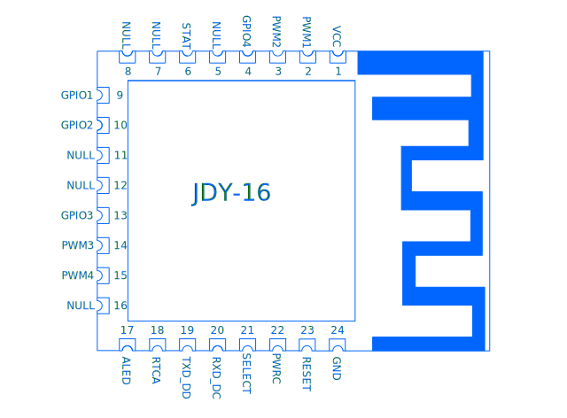
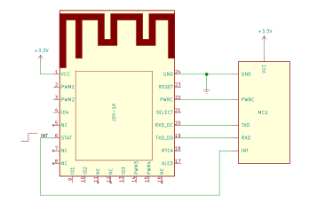
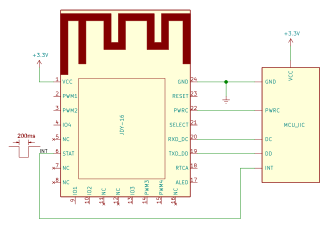
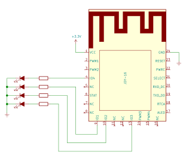
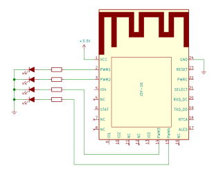

# JDY-16 High Speed Transparent Transmission Bluetooth Module

WeChat Transparent Transmission, APP Transparent Transmission, Master-slave integration, iBeacon

# Version
| Version |    Date    | Instruction                                                                                                           |
|:-------:|------------|-----------------------------------------------------------------------------------------------------------------------|
|   1.2   | 2017-08-19 | Release version                                                                                                       |
|   1.4   | 2017-10-26 | WeChat sports has been added Modify the boot wake stat  Added 128 bit UUID support  Added the feature UUID:FFE3 |
|   1.5   | 2017-11-01 | Updating IIC power consumption and 128 bit UUID problems                                                              |

[Table of contents](#table-of-contents)

# Table of contents
- [1. Product brief introduction](#1-product-brief-introduction)
- [2. Debugging tools](#2-debugging-tools)
- [3. Module parameter details](#3-module-parameter-details)
	- [Module parameter](#module-parameter)
	- [Working current](#working-current)
	- [Description of JDY-16 sleep mode](#description-of-jdy-16-sleep-mode)
	- [FAQ](#faq)
	- [Default parameter configuration for factory](#default-parameter-configuration-for-factory)
	- [Pin definition](#pin-definition)
	- [Pin function description](#pin-function-description)
	- [Dimensional drawing](#dimensional-drawing)
	- [Serial port AT instruction set](#serial-port-at-instruction-set)
- [4. AT instruction description](#4-at-instruction-description)
	- [Settings / Queries - APP permission](#settings--queries---app-permission)
	- [Soft reset](#soft-reset)
	- [Settings / Queries - Device style](#settings--queries---device-style)
	- [Restore factory configuration (revert to factory default configuration Parameter)](#restore-factory-configuration-revert-to-factory-default-configuration-parameter)
	- [Settings / Queries - Boot sleep and wake up reading and writing](#settings--queries---boot-sleep-and-wake-up-reading-and-writing)
	- [Settings / Queries - Sleep Instruction (can broadcast under sleep state)](#settings--queries---sleep-instruction-can-broadcast-under-sleep-state)
	- [Settings / Queries - Baud rate](#settings--queries---baud-rate)
	- [Settings -  Disconnect](#settings----disconnect)
	- [Settings / Queries - Broadcast switch](#settings--queries---broadcast-switch)
	- [Settings / Queries - Mode work pattern](#settings--queries---mode-work-pattern)
	- [Settings / Queries - Broadcast interval](#settings--queries---broadcast-interval)
	- [Settings / Queries - Broadcast name](#settings--queries---broadcast-name)
	- [Settings / Queries - Long Broadcast name](#settings--queries---long-broadcast-name)
	- [Settings / Queries - Broadcast name F](#settings--queries---broadcast-name-f)
	- [Settings / Queries - MAC address (The MAC address of the module can be changed)](#settings--queries---mac-address-the-mac-address-of-the-module-can-be-changed)
	- [Settings / Queries - Transmit power](#settings--queries---transmit-power)
	- [iBeacon (iBeacon mode Instruction)](#ibeacon-ibeacon-mode-instruction)
		- [Settings / Queries - iBeacon UUID (iBeacon mode Instruction)](#settings--queries---ibeacon-uuid-ibeacon-mode-instruction)
		- [Settings / Queries - iBeacon Major (iBeacon mode Instruction)](#settings--queries---ibeacon-major-ibeacon-mode-instruction)
		- [Settings / Queries - iBeacon Minor (iBeacon mode Instruction)](#settings--queries---ibeacon-minor-ibeacon-mode-instruction)
		- [Settings / Queries - iBeacon IBSING (iBeacon mode Instruction)](#settings--queries---ibeacon-ibsing-ibeacon-mode-instruction)
		- [Queries - Version number (iBeacon mode Instruction)](#queries---version-number-ibeacon-mode-instruction)
	- [Settings / Queries - Manufacturer identification code (iBeacon mode Instruction)](#settings--queries---manufacturer-identification-code-ibeacon-mode-instruction)
	- [Settings / Queries - Password connection switch](#settings--queries---password-connection-switch)
	- [Settings / Queries - Connection password](#settings--queries---connection-password)
	- [Settings / Queries - Service UUID (Service UUID in APP data communication)](#settings--queries---service-uuid-service-uuid-in-app-data-communication)
	- [Settings / Queries - Feature UUID (Service UUID in APP data communication)](#settings--queries---feature-uuid-service-uuid-in-app-data-communication)
	- [Settings - Master scan](#settings---master-scan)
	- [Settings / Queries - Master connect slave](#settings--queries---master-connect-slave)
	- [Settings / Queries - Master binding MAC address](#settings--queries---master-binding-mac-address)
	- [Settings - Master cancels binding](#settings---master-cancels-binding)
	- [Settings / Queries - Connection state](#settings--queries---connection-state)
	- [RTC](#rtc)
		- [Settings / Queries - RTC year/month/time/minute/second](#settings--queries---rtc-yearmonthtimeminutesecond)
		- [Settings / Queries - RTC open & close](#settings--queries---rtc-open--close)
	- [Settings / Queries - WeChat H5 or server selection](#settings--queries---wechat-h5-or-server-selection)
	- [PWM](#pwm)
		- [Settings / Queries - PWM frequency](#settings--queries---pwm-frequency)
		- [Settings / Queries - Open & close PWM](#settings--queries---open--close-pwm)
		- [Settings / Queries - PWM1 pulse width](#settings--queries---pwm1-pulse-width)
		- [Settings / Queries - PWM2 pulse width](#settings--queries---pwm2-pulse-width)
		- [Settings / Queries - PWM3 pulse width](#settings--queries---pwm3-pulse-width)
		- [Settings / Queries - PWM4 pulse width](#settings--queries---pwm4-pulse-width)
	- [Settings / Queries - Serial port parity check bit](#settings--queries---serial-port-parity-check-bit)
	- [Settings / Queries - WeChat (automatic, manual) test mode](#settings--queries---wechat-automatic-manual-test-mode)
	- [Settings / Queries - Broadcast indicating LED lamp](#settings--queries---broadcast-indicating-led-lamp)
	- [Settings – from module IO](#settings--from-module-io)
	- [Settings / queries - Module communication enable with low rate BLE](#settings--queries---module-communication-enable-with-low-rate-ble)
	- [Settings / queries - APP writes UUID](#settings--queries---app-writes-uuid)
	- [Settings - WeChat sport (step data, distance, calories)](#settings---wechat-sport-step-data-distance-calories)
	- [Settings - WeChat sport (target)](#settings---wechat-sport-target)
	- [Settings / queries - UUID is 128 for 16 bits](#settings--queries---uuid-is-128-for-16-bits)
- [5. IIC communication format](#5-iic-communication-format)
- [6. Mobile terminal instructions](#6-mobile-terminal-instructions)
	- [APP UUID list](#app-uuid-list)
	- [APP command usage instructions (IO)](#app-command-usage-instructions-io)
		- [1. APP transparent transmission (using feature UUID:FFE2)](#1-app-transparent-transmission-using-feature-uuidffe2)
		- [2. APP control IO port (using feature UUID:FFE2)](#2-app-control-io-port-using-feature-uuidffe2)
		- [3. APP setting and reading iBeacon UUID (using feature UUID:FFE2)](#3-app-setting-and-reading-ibeacon-uuid-using-feature-uuidffe2)
		- [4. APP setting iBeacon MAJOR (using feature UUID:FFE2)](#4-app-setting-ibeacon-major-using-feature-uuidffe2)
		- [5. APP setting iBeacon MINOR (using feature UUID:FFE2)](#5-app-setting-ibeacon-minor-using-feature-uuidffe2)
		- [6. APP setting iBeacon SING (using feature UUID:FFE2)](#6-app-setting-ibeacon-sing-using-feature-uuidffe2)
		- [7. APP sets Bluetooth broadcast name (using feature UUID:FFE2)](#7-app-sets-bluetooth-broadcast-name-using-feature-uuidffe2)
		- [8. APP setting and read Connection password (use feature UUID:FFE2)](#8-app-setting-and-read-connection-password-use-feature-uuidffe2)
		- [9. APP reset Bluetooth module (use feature UUID:FFE2)](#9-app-reset-bluetooth-module-use-feature-uuidffe2)
		- [10. APP request hardware active disconnect from APP (use feature UUID:FFE2)](#10-app-request-hardware-active-disconnect-from-app-use-feature-uuidffe2)
		- [11. APP read module version (using feature UUID:FFE2)](#11-app-read-module-version-using-feature-uuidffe2)
		- [12. APP read module MAC address (using feature UUID:FFE2)](#12-app-read-module-mac-address-using-feature-uuidffe2)
		- [13. APP control PWM switch (using feature UUID:FFE2)](#13-app-control-pwm-switch-using-feature-uuidffe2)
- [7. JDY-16 basic application wiring diagram](#7-jdy-16-basic-application-wiring-diagram)
	- [Wiring diagram of serial port communication mode](#wiring-diagram-of-serial-port-communication-mode)
	- [Wiring diagram of IIC communication mode](#wiring-diagram-of-iic-communication-mode)
	- [IO control wiring diagram](#io-control-wiring-diagram)
	- [PWM control wiring diagram](#pwm-control-wiring-diagram)

## 1. Product brief introduction
The JDY-16 transmission module is based on Bluetooth 4.2 standard, the working frequency is 2.4GHZ, the modulation mode is GFSK, the maximum transmission power is 0db, and the maximum transmission distance is 60 meters, using imported original chip design, which supports users to modify the name of the device, service UUID, transmit power, pairing passwords and other instructions through the AT command, convenient and flexible to use.

JDY-16 Bluetooth module can realize data transmission between module and mobile phone or module and module, and can select UART or IIC communication mode through IO, and through simple configuration, you can quickly use BLE Bluetooth for product applications.

**Make BLE be faster and more convenient in product application.**

[TOC](#table-of-contents)

## 2. Debugging tools
[:link: Termite](https://www.compuphase.com/software_termite.htm): a simple RS232 terminal:

[:link: Null-modem emulator (com0com)](http://com0com.sourceforge.net/)

[.png)](http://com0com.sourceforge.net/)

[TOC](#table-of-contents)

## 3. Module parameter details
### Module parameter
**JDY-16 product parameters**
| Parameter                     | Description                                      |
|-------------------------------|--------------------------------------------------|
| Model                         | JDY-16                                           |
| Working frequency band        | 2.4G                                             |
| Transmit power                | 0db (Max)                                        |
| Communication interface       | UART or IIC                                      |
| Working voltage               | 1.8V – 3.6V                                      |
| Working temperature           | -40ºC - 80ºC                                     |
| Antenna                       | Built in PCB antenna                             |
| Receiving sensitivity         | -97dbm                                           |
| Transmission distance         | 60 meters                                        |
| Module size                   | 19.6mm * 14.94mm * 2.6mm                         |
| Bluetooth version             | BLE 4.2 (compatible with BLE4.0, BLE4.1)         |
| Transparent transmission rate | 115200 bps/s                                     |
| Wake-up status current        | 4mA (Broadcast)                                  |
| Light sleep status current    | <300uA (Broadcast)                               |
| Deep sleep status current     | 1.8uA (No broadcast)                             |
| Instruction parameter saving  | Parameter configuration power down data is saved |
| STM welding temperature       | < 300ºC                                          |

[TOC](#table-of-contents)

### Working current
| Working mode                | Broadcast state           | Current | Remarks   |
|-----------------------------|---------------------------|---------|-----------|
| Wake up                     | Broadcast                 |     4mA | Remark #1 |
| Deep no broadcast sleep     | No broadcast              |  1.38uA | Remark #1 |
| Light sleep broadcast sleep |  100ms broadcast interval |   280uA | Remark #1 |
| Average power consumption   |  200ms broadcast interval |   140uA | Remark #1 |
| Average power consumption   |  300ms broadcast interval |    80uA | Remark #1 |
| Average power consumption   |  400ms broadcast interval | << 80uA | Remark #1 |
| Average power consumption   |  500ms broadcast interval | << 80uA | Remark #1 |
| Average power consumption   |  600ms broadcast interval | << 80uA | Remark #1 |
| Average power consumption   |  700ms broadcast interval | << 80uA | Remark #1 |
| Average power consumption   |  800ms broadcast interval | << 80uA | Remark #1 |
| Average power consumption   |  900ms broadcast interval | << 80uA | Remark #1 |
| Average power consumption   | 1000ms broadcast interval | << 80uA | Remark #1 |
| Wake up state               | Connected                 |     4mA | Remark #2 |
| Sleep state                 | Connected                 |    50uA | Remark #2 |

**Remarks**
1. Generally communicate with APP connection, it suggests broadcast should not be set too long, which will affect the connection time. It is generally recommended between 100 to 500ms, and if you need to connect fast and no power requirements, broadcast intervals can be set to the shortest.
2. Under connection state, the AT command can be pulled down by PWRC pin or the working mode is set directly, please see the [AT+STARTEN](#settings--queries---boot-sleep-and-wake-up-reading-and-writing) instructions

[TOC](#table-of-contents)

### Description of JDY-16 sleep mode
AT instruction: [AT+STARTEN](#settings--queries---boot-sleep-and-wake-up-reading-and-writing)
- **Mode 0**
  Wake up, users need sleep can be controlled by AT+SLEEP command, wake up can be controlled by PWRC pin wake-up.
- **Mode 1**
  Boot sleep, wake up after the connection, disconnect automatically into sleep.
	**Note: AT+SLEEP invalid mode 1, sleep controls sleep by Bluetooth module itself.**

- **Mode 2**
  Boot sleep, connect and disconnect all sleep, APP to send data to the serial port module or module to send data automatic wake-up, after data transmission is completed, it will be automatic sleep.
	**Note: AT+SLEEP of mode 1 is invalid.**
	**Note: AT+SLEEP invalid mode 1, sleep controls sleep by Bluetooth module itself.**

[TOC](#table-of-contents)

### FAQ
1. **How does MCU disconnect Bluetooth connection under connection state?**
   In the connection state, the PWRC pin is pulled down, and the serial port sends AT+DISC to disconnect the connection
	 IIC can disconnect the memory address: 0x15 writes 0x01 values to indicate disconnection
2. **Can it write data to the module if the connection password is incorrect?**
   No, it can’t. Only the correct password can write data to the module
3. **How much data can the serial port write at one time?**
   No byte limit, 100k can be sent once (master-slave communication)
4. **How fast can the fastest communication rate be reached?**
   With mobile phone measured 8K Bytes per second, module master slave communication can achieve 115200 baud rate continuous transceiver, and the rate of 115200bps.
5. **After configuring parameters by serial port or IIC, does it need to be restarted to take effect?**
   It is recommended to restart when the module parameters are set.
6. **Parameters of serial port or IIC configuration, is the power up stored next time?**
   After saving, configuring, the next power up is the last configuration parameter.
7. **How to test the deep sleep current of test module?**
   It is recommended to connect the VCC and GND pins to test current.

[TOC](#table-of-contents)

### Default parameter configuration for factory

| Seq | Function                               | Default parameters of factory                              | Instructions           |
|----:|----------------------------------------|------------------------------------------------------------|------------------------|
|   1 | Communication mode                     | UART                                                       | **SELECT pin hanging** |
|   2 | Serial port baud rate                  | 9600                                                       | **AT+BAUD4**           |
|   3 | Sleep mode                             | Boot wake up                                               | **AT+STARTEN0**        |
|   4 | Broadcast name                         | JDY-16                                                     | **AT+NAMEJDY-16**      |
|   5 | Broadcast interval                     | 100ms                                                      | **AT+ADVIN0**          |
|   6 | Master slave mode                      | slave transparent transmission                             | **AT+HOSTEN0**         |
|   7 | Output status                          | connection or disconnection status output from serial port | **AT+ENLOG1**          |
|   8 | Broadcast LED indicator                | On                                                         | **AT+ALED1**           |
|   9 | Transparent transmission service UUID  | 0xFFE0                                                     | **AT+SVRUUIDFFE0**     |
|  10 | Transparent transmission features UUID | 0xFFE1                                                     | **AT+CHRUUIDFFE1**     |
|  11 | Function configuration UUID            | 0xFFE2                                                     | **Unmodifiable**       |
|  12 | APP write feature UUID                 | 0xFFE3                                                     | **AT+CRXUUIDFFE3**     |

**Special note: Transparent transmission service UUID, transparent transmission features UUID, APP write feature UUID all support 16 bit or 128 bit UUID.**

[TOC](#table-of-contents)

### Pin definition

[TOC](#table-of-contents)

### Pin function description
|Pin | Function  | Description                                                                                                                                                                                                                                                                                     |
|---:|-----------|-------------------------------------------------------------------------------------------------------------------------------------------------------------------------------------------------------------------------------------------------------------------------------------------------|
|  1 | VCC       | Power supply (1.8 - 3.6V)                                                                                                                                                                                                                                                                         |
|  2 | PWM1      | Support UART, IIC, APP control                                                                                                                                                                                                                                                                  |
|  3 | PWM2      | Support UART, IIC, APP control                                                                                                                                                                                                                                                                  |
|  4 | IO4       | High and low electrical level can be controlled by APP                                                                                                                                                                                                                                          |
|  5 | NC        |                                                                                                                                                                                                                                                                                                 |
|  6 | STAT      | **UART communication mode**: not connected low electrical level, high electrical level after connection.  **IIC communication mode**: not connected high electrical level, connection, disconnect or receive data will work in interrupt mode, interrupt the falling edge holding time 200ms |
|  7 | NC        |                                                                                                                                                                                                                                                                                                 |
|  8 | NC        |                                                                                                                                                                                                                                                                                                 |
|  9 | IO1       | High and low electrical level can be controlled by APP                                                                                                                                                                                                                                          |
| 10 | IO2       | High and low electrical level can be controlled by APP                                                                                                                                                                                                                                          |
| 11 | NC        |                                                                                                                                                                                                                                                                                                 |
| 12 | NC        |                                                                                                                                                                                                                                                                                                 |
| 13 | IO3       | High and low electrical level can be controlled by APP                                                                                                                                                                                                                                          |
| 14 | PWM3      | Support UART, IIC, APP control                                                                                                                                                                                                                                                                  |
| 15 | PWM4      | Support UART, IIC, APP control                                                                                                                                                                                                                                                                  |
| 16 | NC        |                                                                                                                                                                                                                                                                                                 |
| 17 | ALED      | Broadcast flashes, always bright after connection (master-slave effective)                                                                                                                                                                                                                      |
| 18 | RTCA      | RTC timing time to produce a drop edge interrupt signal, usually high electrical level                                                                                                                                                                                                          |
| 19 | TXD_OR_DD | SELECT boot to High electrical level, the pin function of this serial port is TXD  SELECT boot to Low electrical level, this pin function is IIC DD                                                                                                                                          |
| 20 | RXD_OR_DC | SELECT boot to High electrical level, the pin function of this serial port is RXD  SELECT boot to Low electrical level, this pin function is IIC DC                                                                                                                                          |
| 21 | SELECT    | UART or IIC select pin  Boot Low electrical level: IIC communication mode  Boot High electrical level: UART communication mode  The default SELECT is suspended as high electrical level: UART communication mode, when the user needs IIC, the SELECT pin is required to be grounded  |
| 22 | PWRC      | When the AT instruction is required to be sent in the connection state, the AT instruction mode can be displayed by maintaining the Low electrical level of the pin. In the unconnected state, this pin is AT command mode regardless of the high and low electrical levels                     |
| 23 | RESET     | Hardware reset pin                                                                                                                                                                                                                                                                              |
| 24 | GND       | Power ground                                                                                                                                                                                                                                                                                    |

[TOC](#table-of-contents)

### Dimensional drawing
JDY-16 specifications are in the data PCB package folder, and the format is CAD version of the document.

[TOC](#table-of-contents)

### Serial port AT instruction set
:warning: JDY-16 module serial port send AT instruction must add \r\n, AT does not distinguish case

| Seq. | Instruction | Function                                                                  | Master / Slave | Work mode                  | Default                          |
|------|-------------|---------------------------------------------------------------------------|:--------------:|----------------------------|----------------------------------|
|   1  | AT+PERM     | APP permission configuration                                              |       S        |                            | IO, PWM open                     |
|   2  | AT+RST      | Reset                                                                     |      M/S       | -                          |                                  |
|   3  | AT+HOSTEN   | Master-slave setting                                                      |      M/S       | -                          | slave                            |
|   4  | AT+MAC      | Device MAC                                                                |      M/S       | -                          |                                  |
|   5  | AT+BAUD     | Baud rate                                                                 |      M/S       | -                          | 9600                             |
|   6  | AT+NAME     | Broadcast name                                                            |       S        |                            | JDY-16                           |
|   7  | AT+NL       | Long broadcast name                                                       |       S        |                            | JDY-16                           |
|   8  | AT+NF       | Setting broadcast name does not store FLASH  Power on again, no memory |       S        |                            | JDY-16                           |
|   9  | AT+CONN     | Master connect slave                                                      |       M        |                            |                                  |
|  10  | AT+SCAN     | Master scan slave                                                         |       M        |                            |                                  |
|  11  | AT+BAND     | Master binding slave MAC                                                  |       M        |                            | 000000000000                     |
|  12  | AT+USTP     | Serial port stop bit                                                      |      M/S       |                            | 0                                |
|  13  | AT+SLEEP    | Sleep                                                                     |      M/S       |                            |                                  |
|  14  | AT+PARITY   | Serial port parity check bit                                              |      M/S       |                            | 0                                |
|  15  | AT+PASS     | Slave connection password                                                 |       S        |                            | 123456                           |
|  16  | AT+STARTEN  | Start working mode                                                        |      M/S       |                            | 0                                |
|  17  | AT+DEFAULT  | Restore factory configuration                                             |      M/S       |                            |                                  |
|  18  | AT+FLOWC    | Serial port flow control                                                  |      M/S       |                            | 0                                |
|  19  | AT+VER      | Version number                                                            |      M/S       |                            |                                  |
|  20  | AT+ISCEN    | Slave connection password switch                                          |      M/S       |                            | 0                                |
|  21  | AT+WXSVR    | WeChat Airsync H5 or server                                               |       S        | transp arent trans mission | 0                                |
|  22  | AT+WXINEN   | Manual and automatic test of WeChat Airsync                               |       S        | transp arent trans mission | 0                                |
|  23  | AT+CLSS     | Device style                                                              |       S        |                            | A0                               |
|  24  | AT+VID      | Manufacturer ID identification code                                       |       S        |                            |                                  |
|  25  | AT+MAJOR    | iBeacon MAJOR value                                                       |       S        | iBeacon                    | 0A                               |
|  26  | AT+MINOR    | iBeacon MINOR value                                                       |       S        | iBeacon                    | 07                               |
|  27  | AT+IBUUID   | iBeacon UUID value                                                        |       S        | iBeacon                    | FDA50693A4E24FB1AFCFC6EB07647825 |
|  28  | AT+IBSING   | iBeacon SING value                                                        |       S        | iBeacon                    | 40                               |
|  29  | AT+SVRUUID  | Bluetooth service UUID                                                    |      M/S       | transp arent trans mission | FFE0                             |
|  30  | AT+CHRUUID  | Bluetooth feature UUID                                                    |      M/S       | transp arent trans mission | FFE1                             |
|  31  | AT+ADVIN    | Broadcast interval                                                        |       S        |                            | 1                                |
|  32  | AT+ADVEN    | Broadcast switch                                                          |       S        |                            | 1                                |
|  33  | AT+RTCOPEN  | RTC switch                                                                |      M/S       |                            | 0                                |
|  34  | AT+RTCD     | RTC time read & write                                                     |      M/S       |                            | 2016-01-01,00:00:00              |
|  35  | AT+POWR     | Transmitting power                                                        |       S        |                            | 1                                |
|  36  | AT+DISC     | Disconnect                                                                |       S        |                            |                                  |
|  37  | AT+STAT     | Connection state                                                          |      M/S       |                            | 00                               |
|  38  | AT+ENLOG    | State output enable                                                       |      M/S       |                            | 0                                |
|  39  | AT+PWMFRE   | PWM frequency                                                             |      M/S       |                            | 1000                             |
|  40  | AT+PWMOPEN  | PWM switch                                                                |      M/S       |                            | 0                                |
|  41  | AT+PWM1PUS  | PWM1 pulse width                                                          |      M/S       |                            | 10                               |
|  42  | AT+PWM2PUS  | PWM2 pulse width                                                          |      M/S       |                            | 10                               |
|  43  | AT+PWM3PUS  | PWM3 pulse width                                                          |      M/S       |                            | 10                               |
|  44  | AT+PWM4PUS  | PWM4 pulse width                                                          |      M/S       |                            | 10                               |
|  45  | AT+ALED     | Broadcast indicating LED switch                                           |      M/S       |                            | Open                             |
|  46  | AT+FUNC     | Master controls slave IO or PWM                                           |       M        |                            |                                  |
|  47  | AT+NETIN    | Module communication enable with low rate BLE                             |       M        |                            | 0                                |
|  48  | AT+CHRUUID  | APP writes UUID to modules                                                |      M/S       | transparent transmission   | FFE3                             |
|  49  | AT+WXP      | WeChat steps, distance, calories                                          |       S        |  WeChat sport              | 000000000000000000               |
|  50  | AT+WXT      | WeChat spotr target (step number)                                         |       S        |                            | 00000000                         |
|  51  | AT+UUIDLEN  | 16 bit or 128 bit UUID selection                                          |       S        |                            | 0                                |

[TOC](#table-of-contents)

## 4. AT instruction description
**Special note: JDY-16 module serial port instruction AT need to add terminator \r\n**

### Settings / Queries - APP permission
| Instruction     | Response       | Parameter          |
|-----------------|----------------|--------------------|
| AT+PERM\<Param> | +OK            | Param (5 bit byte) |
| AT+PERM         | +PERM=\<Param> |                    |

Each byte function in 5 bytes is explained in detail

| Param | Function                                        | Permission (Y/N) |
|-------|-------------------------------------------------|------------------|
| Byte1 | Can broadcast be modified by APP?               | Default: N       |
| Byte2 | Can the connection password be modified by APP? | Default: N       |
| Byte3 | Can the APP control the IO electrical level?    | Default: Y       |
| Byte4 | Can APP control PWM?                            | Default: Y       |
| Byte5 | Can APP configure iBeacon Parameter?            | Default: N       |

Y indicates that APP has permission control
N indicates APP without permission control

The above configuration Parameter sends AT+PERM, returns Parameter is: +PERM=00110
The example opens the APP settings (broadcast name, IO, PWM) permissions

**Example**
> **AT+PERM**
> +PERM=01110
> **AT+PERM10110**
> +PERM=10110
> OK

[TOC](#table-of-contents)

### Soft reset
| Instruction     | Response       | Parameter |
|-----------------|----------------|-----------|
| AT+RST          | +OK            | None      |

**Example:**
> **AT+RST**
> OK

[TOC](#table-of-contents)

### Settings / Queries - Device style
| Instruction     | Response       | Parameter                       |
|-----------------|----------------|---------------------------------|
| AT+CLSS\<Param> | +OK            | Param (00-FF)  Default: 0xA0 |
| AT+CLSS         | +CLSS=\<Param> |                                 |

**Example:**
> **AT+CLSS**
> +CLSS=A0
> **AT+CLSSA0**
> +CLSS=A0
> OK

[TOC](#table-of-contents)

### Restore factory configuration (revert to factory default configuration Parameter)
| Instruction     | Response       | Parameter          |
|-----------------|----------------|--------------------|
| AT+DEFAULT      | +OK            | None               |

**Example:**
> **AT+DEFAULT**
> OK

[TOC](#table-of-contents)

### Settings / Queries - Boot sleep and wake up reading and writing
| Instruction        | Response          | Parameter                   |
|--------------------|-------------------|-----------------------------|
| AT+STARTEN\<Param> | +OK               | Param (0-2)  Default: 0  |
| AT+STARTEN         | +STARTEN=\<Param> |                             |

**Param:**
| Value | Description                                                                                           |
|-------|-------------------------------------------------------------------------------------------------------|
|   0   | Wake up, sleep can be controlled by AT+SLEEP                                                          |
|   1   | Boot sleep, connect wake up, disconnect sleep                                                         |
|   2   | Boot sleep, connect sleep, disconnect sleep.  Auto wakeup when sending data by APP or serial port  |

[Description of JDY-16 sleep mode](#description-of-jdy-16-sleep-mode)

**Example:**
> **AT+STARTEN**
> +STARTEN=0
> **AT+STARTEN0**
> +STARTEN=0
> OK

[TOC](#table-of-contents)

### Settings / Queries - Sleep Instruction (can broadcast under sleep state)
| Instruction      | Response  | Parameter   |
|------------------|-----------|-------------|
| AT+SLEEP\<Param> | +SLEEP:OK | Param (1-2) |
| AT+SLEEP         | +SLEEP:OK |             |

**Param:**
| Value | Description               |
|-------|---------------------------|
|   1   | light sleep (Broadcast)   |
|   2   | deep sleep (No Broadcast) |

**Example:**
> **AT+SLEEP**
> OK
> **AT+SLEEP1**
> OK
> +SLEEP

[TOC](#table-of-contents)

### Settings / Queries - Baud rate
:warning: **Note: the default baud rate of the module is: 115200**
| Instruction     | Response       | Parameter                  |
|-----------------|----------------|----------------------------|
| AT+BAUD\<Param> | +OK            | Param (1-9)  Default: 0 |
| AT+BAUD         | +BAUD=\<Param> |                            |

**Param:**
| Value | Baud rate |
|-------|----------:|
|   1   |      1200 |
|   2   |      2400 |
|   3   |      4800 |
|   4   |      9600 |
|   5   |     19200 |
|   6   |     38400 |
|   7   |     57600 |
|   8   |    115200 |
|   9   |    230400 |

**Example:**
> **AT+BAUD**
> +BAUD=4
> **AT+BAUD4**
> +BAUD=4
> OK

[TOC](#table-of-contents)

### Settings -  Disconnect
| Instruction     | Response       | Parameter |
|-----------------|----------------|-----------|
| AT+DISC         | +OK            | None      |

**Example:**
> **AT+DISC**
> OK

[TOC](#table-of-contents)

### Settings / Queries - Broadcast switch
| Instruction      | Response        | Parameter                  |
|------------------|-----------------|----------------------------|
| AT+ADVEN\<Param> | +OK             | Param (0-1)  Default: 1 |
| AT+ADVEN         | +ADVEN=\<Param> |                            |

**Param:**
| Value | Description    |
|-------|----------------|
|   0   | Stop Broadcast |
|   1   | Open Broadcast |

**Example:**
> **AT+ADVEN**
> +ADVEN=1
> **AT+ADVEN0**
> +ADVEN=0
> OK

[TOC](#table-of-contents)

### Settings / Queries - Mode work pattern
| Instruction       | Response         | Parameter                  |
|-------------------|------------------|----------------------------|
| AT+HOSTEN\<Param> | +OK              | Param (0-3)  Default: 0 |
| AT+HOSTEN         | +HOSTEN=\<Param> |                            |

**Param:**
| Value | Description                                                 |
|-------|-------------------------------------------------------------|
|   0   | Slave (APP, WeChat, small program) transparent transmission |
|   1   | Host (Master) transparent transmission mode                 |
|   3   | Slave (iBeacon) mode                                        |

**Example:**
> **AT+HOSTEN**
> +HOSTEN=0
> **AT+HOSTEN1**
> +HOSTEN=1
> OK

[TOC](#table-of-contents)

### Settings / Queries - Broadcast interval
| Instruction      | Response        | Parameter                  |
|------------------|-----------------|----------------------------|
| AT+ADVIN\<Param> | +OK             | Param (0-9)  Default: 0 |
| AT+ADVIN         | +ADVIN=\<Param> |                            |

**Param:**
| Value | Description |
|-------|------------:|
|   0   |     100ms   |
|   1   |     200ms   |
|   2   |     300ms   |
|   3   |     400ms   |
|   4   |     500ms   |
|   5   |     600ms   |
|   6   |     700ms   |
|   7   |     800ms   |
|   8   |     900ms   |
|   9   |    1000ms   |

**Example:**
> **AT+ADVIN**
> +ADVIN=1
> **AT+ADVIN0**
> +ADVIN=0
> OK

[TOC](#table-of-contents)

### Settings / Queries - Broadcast name
| Instruction     | Response       | Parameter       |
|-----------------|----------------|-----------------|
| AT+NAME\<Param> | +OK            | Default: JDY-16 |
| AT+NAME         | +NAME=\<Param> |                 |

**Param:**
Mode Bluetooth name.
The longest: 18 bytes

**Example:**
> **AT+NAME**
> +NAME=JDY-16
> **AT+NAMEJDY-16v2.3**
> +NAME=JDY-16v2.3
> OK

[TOC](#table-of-contents)

### Settings / Queries - Long Broadcast name
| Instruction   | Response     | Parameter       |
|---------------|--------------|-----------------|
| AT+NL\<Param> | +OK          | Default: JDY-16 |
| AT+NL         | +NL=\<Param> |                 |

**Param:**
Mode Bluetooth name.
The longest: 18 bytes

**Example:**
> **AT+NL**
> +NL=JDY-16
> **AT+NLJDY-16v2.3**
> +NL=JDY-16v2.3
> OK

### Settings / Queries - Broadcast name F
| Instruction   | Response     | Parameter       |
|---------------|--------------|-----------------|
| AT+NF\<Param> | +OK          | Default: JDY-16 |
| AT+NF         | +NL=\<Param> |                 |

**Param:**
Mode Bluetooth name.
The longest: 18 bytes

**Example:**
> **AT+NF**
> +NL=JDY-16
> **AT+NFJDY-16v2.3**
> +NL=JDY-16v2.3
> OK

[TOC](#table-of-contents)

### Settings / Queries - MAC address (The MAC address of the module can be changed)
| Instruction    | Response      | Parameter         |
|----------------|---------------|-------------------|
| AT+MAC\<Param> | +OK           | Param MAC address |
| AT+MAC         | +MAC=\<Param> |                   |

**Example:**
> AT+MAC
> +MAC=3CA5197B14DC

[TOC](#table-of-contents)

### Settings / Queries - Transmit power
| Instruction     | Response       | Parameter                  |
|-----------------|----------------|----------------------------|
| AT+POWR\<Param> | +OK            | Param (0-1)  Default: 1 |
| AT+POWR         | +POWR=\<Param> |                            |

**Param:**
| Value | Description |
|-------|------------:|
|   0   |     -16db   |
|   1   |       0db   |

**Example:**
> **AT+POWR**
> +POWR=1
> **AT+POWR0**
> +POWR=0
> OK

[TOC](#table-of-contents)

### iBeacon (iBeacon mode Instruction)
#### Settings / Queries - iBeacon UUID (iBeacon mode Instruction)
| Instruction       | Response         | Parameter              |
|-------------------|------------------|------------------------|
| AT+IBUUID\<Param> | +OK              | Param Hexadecimal UUID |
| AT+IBUUID         | +IBUUID=\<Param> |                        |
**Default UUID: FDA50693A4E24FB1AFCFC6EB07647825**
**Hexadecimal data**

**Example:**
> **AT+IBUUID**
> +IBUUID=FDA50693A4E24FB1AFCFC6EB07647825
> **AT+IBUUID0xFDA50693A4E24FB1AFCFC6EB07647825**
> +IBUUID=FDA50693A4E24FB1AFCFC6EB07647825
> OK

**Note**: In **Termite**, with the **Hex View** plugin, can send hexadecimal data with **0x** prefix.

[TOC](#table-of-contents)

#### Settings / Queries - iBeacon Major (iBeacon mode Instruction)
| Instruction      | Response        | Parameter                            |
|------------------|-----------------|--------------------------------------|
| AT+MAJOR\<Param> | +OK             | Param: (0000-FFFF)  Default: 000A |
| AT+MAJOR         | +MAJOR=\<Param> |                                      |

**Example:**
> **AT+MAJOR**
> +MAJOR=000A
> **AT+MAJOR000A**
> +MAJOR=000A
> OK

[TOC](#table-of-contents)

#### Settings / Queries - iBeacon Minor (iBeacon mode Instruction)
| Instruction      | Response        | Parameter                            |
|------------------|-----------------|--------------------------------------|
| AT+MINOR\<Param> | +OK             | Param: (0000-FFFF)  Default: 0007 |
| AT+MINOR         | +MINOR=\<Param> |                                      |

**Example:**
> **AT+MINOR**
> +MINOR=0007
> **AT+MINOR0007**
> +MINOR=0007
> OK

[TOC](#table-of-contents)

#### Settings / Queries - iBeacon IBSING (iBeacon mode Instruction)
| Instruction       | Response         | Parameter                      |
|-------------------|------------------|--------------------------------|
| AT+IBSING\<Param> | +OK              | Param: (00-FF)  Default: 40 |
| AT+IBSING         | +IBSING=\<Param> |                                |
**This Parameter is applied to signal check value of iBeacon within 1 meter**

**Example:**
> **AT+IBSING**
> +IBSING=D0
> **AT+IBSINGD0**
> +IBSING=D0
> OK

[TOC](#table-of-contents)

#### Queries - Version number (iBeacon mode Instruction)
| Instruction | Response         | Parameter |
|-------------|------------------|-----------|
| AT+VER      | +VER=JDY-16-V2.3 | None      |

**Example:**
> **AT+VER**
> +VER=JDY-16-V2.3

[TOC](#table-of-contents)

### Settings / Queries - Manufacturer identification code (iBeacon mode Instruction)
| Instruction    | Response      | Parameter                      |
|----------------|---------------|--------------------------------|
| AT+VID\<Param> | +OK           | Param: (00-FF)  Default: 88 |
| AT+VID         | +VID=\<Param> |                                |

**Example:**
> **AT+VID**
> +VID=88
> **AT+VID88**
> +VID=88
> OK

[TOC](#table-of-contents)

### Settings / Queries - Password connection switch
| Instruction      | Response        | Parameter                  |
|------------------|-----------------|----------------------------|
| AT+ISCEN\<Param> | +OK             | Param (0-1)  Default: 0 |
| AT+ISCEN         | +ISCEN=\<Param> |                            |

**Param:**
| Value | Description                           |
|-------|---------------------------------------|
|   0   | Not open password connection function |
|   1   | Open password connection is not bound |

**Example:**
> **AT+ISCEN**
> +ISCEN=0
> **AT+ISCEN1**
> +ISCEN=1
> OK

[TOC](#table-of-contents)

### Settings / Queries - Connection password
| Instruction     | Response       | Parameter                                              |
|-----------------|----------------|--------------------------------------------------------|
| AT+PASS\<Param> | +OK            | Param: 6 bit number password  Default value: 123456 |
| AT+PASS         | +PASS=\<Param> |                                                        |

**Example:**
> **AT+PASS**
> +PASS=123456
> **AT+PASS654321**
> +PASS=654321
> OK

[TOC](#table-of-contents)

### Settings / Queries - Service UUID (Service UUID in APP data communication)
| Instruction        | Response          | Parameter                            |
|--------------------|-------------------|--------------------------------------|
| AT+SVRUUID\<Param> | +OK               | Param: (0000-FFFF)  Default: FFE0 |
| AT+SVRUUID         | +SVRUUID=\<Param> |                                      |

**Example:**
> **AT+SVRUUID**
> +SVRUUID=FFE0
> **AT+SVRUUIDFFE0**
> OK

[TOC](#table-of-contents)

### Settings / Queries - Feature UUID (Service UUID in APP data communication)
| Instruction        | Response          | Parameter                            |
|--------------------|-------------------|--------------------------------------|
| AT+CHRUUID\<Param> | +OK               | Param: (0000-FFFF)  Default: FFE1 |
| AT+CHRUUID         | +CHRUUID=\<Param> |                                      |

**Example:**
>**AT+CHRUUIDFFE1**
>OK
>**AT+CHRUUID**
>+CHRUUID=FFE1

[TOC](#table-of-contents)

### Settings - Master scan
| Instruction | Response | Parameter |
|-------------|----------|-----------|
| AT+SCAN     | OK       | None      |

**Example:**
> **AT+SCAN**
> OK
> +DEV:1=1893D711AB87,-82,JDY-08
> +DEV:3=0F0F88100395,-82,JDY-19
> +STOP:SCAN

The Master scans MAC, RSSI, and device names from the machine

[TOC](#table-of-contents)

### Settings / Queries - Master connect slave
| Instruction     | Response       | Parameter           |
|-----------------|----------------|---------------------|
| AT+CONN\<Param> | +OK            | Param: (0-7 \| MAC) |
| AT+CONN         | +CONN=\<Param> |                     |

**Param:**
- Search list connection: List id from SCAN (0-7)
- Direct MAC address connection: Dev MAC

**Examples:**
> **AT+CONN3**
> OK
> +CONNECTED>>0x0F0F88100395
> **AT+CONN0F0F88100395**
> OK
> +CONNECTED>>0x0F0F88100395

[TOC](#table-of-contents)

### Settings / Queries - Master binding MAC address
| Instruction     | Response      | Parameter    |
|-----------------|---------------|--------------|
| AT+BAND\<Param> | +OK           | Param: (MAC) |
| AT+BAND         | +MAC=\<Param> |              |

**Examples:**
> **AT+BAND**
> +MAC:000000000000
> **AT+BAND0F0F88100395**
> OK
> +BAND
> +CONNECTED>>0x0F0F88100395

[TOC](#table-of-contents)

### Settings - Master cancels binding
| Instruction | Response | Parameter |
|-------------|----------|-----------|
| AT+CLRBAND  | OK       | None      |

**Example**
> **AT+CLRBAND**
> OK
> +CLR:BAND

[TOC](#table-of-contents)

### Settings / Queries - Connection state
| Instruction | Response       | Parameter              |
|-------------|----------------|------------------------|
| AT+STAT     | +STAT=\<Param> | Connection state (0-1) |

**Param:**
| Value | Description   |
|-------|---------------|
|   0   | Not connected |
|   1   | Connected     |

**Example**
> **AT+STAT**
> +STAT=0

[TOC](#table-of-contents)

### RTC
#### Settings / Queries - RTC year/month/time/minute/second
| Instruction     | Response       | Parameter                                                     |
|-----------------|----------------|---------------------------------------------------------------|
| AT+RTCD\<Param> | +OK            | Param: (YYYY-MM-DD,HH:MM:SS)  Default: 2016-01-01,00:00:00 |
| AT+RTCD         | +RTCD=\<Param> |                                                               |

**Examples:**
> **AT+RTCD**
> +RTCDATE=2016-01-01,00:00:00
> **AT+RTCD2021-05-13,17:46:00**
> +RTCDATE=2021-05-13,17:46:00
> OK

[TOC](#table-of-contents)

#### Settings / Queries - RTC open & close
| Instruction        | Response          | Parameter                   |
|--------------------|-------------------|-----------------------------|
| AT+RTCOPEN\<Param> | OK                | Param: (0-1)  Default: 0 |
| AT+RTCOPEN         | +RTCOPEN=\<Param> |                             |

**Param:**
| Value | Description                                          |
|-------|------------------------------------------------------|
|   0   | Indicates closing the RTC function                   |
|   1   | Indicates turn on the switch and switch on next time |

**Example**
> **AT+RTCOPEN**
> +RTCOPEN=0
> **AT+RTCOPEN1**
> +RTCOPEN=1
> OK

[TOC](#table-of-contents)

### Settings / Queries - WeChat H5 or server selection
| Instruction      | Response        | Parameter                   |
|------------------|-----------------|-----------------------------|
| AT+WXSVR\<Param> | OK              | Param: (0-1)  Default: 0 |
| AT+WXSVR         | +WXSVR=\<Param> |                             |

**Param:**
| Value | Description          |
|-------|----------------------|
|   0   | H5 communication     |
|   1   | Server communication |

**Example**
> **AT+WXSVR**
> +WXSVR=0
> **AT+WXSVR1**
> +WXSVR=1
> OK

[TOC](#table-of-contents)

### PWM
#### Settings / Queries - PWM frequency
| Instruction       | Response         | Parameter                           |
|-------------------|------------------|-------------------------------------|
| AT+PWMFRE\<Param> | OK               | Param: (30-25000)  Default: 1000 |
| AT+PWMFRE         | +PWMFRE=\<Param> |                                     |

**Param:**
Param is frequency in Hz. It can be set from 30Hz to 25kHz.

**Example**
> **AT+PWMFRE**
> +PWMFRE=0100
> **AT+PWMFRE2000**
> +PWMFRE=0200
> OK

[TOC](#table-of-contents)

#### Settings / Queries - Open & close PWM
| Instruction        | Response          | Parameter                   |
|--------------------|-------------------|-----------------------------|
| AT+PWMOPEN\<Param> | OK                | Param: (0-1)  Default: 0 |
| AT+PWMOPEN         | +PWMOPEN=\<Param> |                             |

**Param:**
| Value | Description |
|-------|-------------|
|   0   | Close PWM   |
|   1   | Open PWM    |

**Example**
> **AT+PWMOPEN**
> +PWMOPEN=0
> **AT+PWMOPEN1**
> +PWMOPEN=1
> OK

[TOC](#table-of-contents)

#### Settings / Queries - PWM1 pulse width
| Instruction        | Response          | Parameter                      |
|--------------------|-------------------|--------------------------------|
| AT+PWM1PUS\<Param> | OK                | Param: (0-255)  Default: 10 |
| AT+PWM1PUS         | +PWM1PUS=\<Param> |                                |

**Param:**
PWM pulse width. 255 is 100% of width.

**Example**
> **AT+PWM1PUS**
> +PWM1PUS=10
> **AT+PWM1PUS255**
> +PWM1PUS=255
> OK

[TOC](#table-of-contents)

#### Settings / Queries - PWM2 pulse width
| Instruction        | Response          | Parameter                      |
|--------------------|-------------------|--------------------------------|
| AT+PWM2PUS\<Param> | OK                | Param: (0-255)  Default: 10 |
| AT+PWM2PUS         | +PWM2PUS=\<Param> |                                |

**Param:**
PWM pulse width. 255 is 100% of width.

**Example**
> **AT+PWM2PUS**
> +PWM2PUS=10
> **AT+PWM2PUS255**
> +PWM2PUS=255
> OK

[TOC](#table-of-contents)

#### Settings / Queries - PWM3 pulse width
| Instruction        | Response          | Parameter                      |
|--------------------|-------------------|--------------------------------|
| AT+PWM3PUS\<Param> | OK                | Param: (0-255)  Default: 10 |
| AT+PWM3PUS         | +PWM3PUS=\<Param> |                                |

**Param:**
PWM pulse width. 255 is 100% of width.

**Example**
> **AT+PWM3PUS**
> +PWM3PUS=10
> **AT+PWM3PUS255**
> +PWM3PUS=255
> OK

[TOC](#table-of-contents)

#### Settings / Queries - PWM4 pulse width
| Instruction        | Response          | Parameter                      |
|--------------------|-------------------|--------------------------------|
| AT+PWM4PUS\<Param> | OK                | Param: (0-255)  Default: 10 |
| AT+PWM4PUS         | +PWM4PUS=\<Param> |                                |

**Param:**
PWM pulse width. 255 is 100% of width.

**Example**
> **AT+PWM4PUS**
> +PWM4PUS=10
> **AT+PWM4PUS255**
> +PWM4PUS=255
> OK

[TOC](#table-of-contents)

### Settings / Queries - Serial port parity check bit
| Instruction       | Response         | Parameter                   |
|-------------------|------------------|-----------------------------|
| AT+PARITY\<Param> | OK               | Param: (0-2)  Default: 0 |
| AT+PARITY         | +PARITY=\<Param> |                             |

**Param:**
| Value | Description     |
|-------|-----------------|
|   0   | No parity bit   |
|   1   | Odd parity bit  |
|   2   | Even parity bit |

**Example**
> **AT+PARITY**
> +PARITY=0
> **AT+PARITY0**
> +PARITY=0
> OK

[TOC](#table-of-contents)

### Settings / Queries - WeChat (automatic, manual) test mode
| Instruction       | Response         | Parameter                   |
|-------------------|------------------|-----------------------------|
| AT+WXINEN\<Param> | OK               | Param: (0-1)  Default: 0 |
| AT+WXINEN         | +WXINEN=\<Param> |                             |

**Param:**
| Value | Description                |
|-------|----------------------------|
|   0   | WeChat manual test mode    |
|   1   | WeChat automatic test mode |

**Example**
> **AT+WXINEN**
> +WXINEN=0
> **AT+WXINEN1**
> +WXINEN=1
> OK

[TOC](#table-of-contents)

### Settings / Queries - Broadcast indicating LED lamp
| Instruction     | Response       | Parameter                   |
|-----------------|----------------|-----------------------------|
| AT+ALED\<Param> | OK             | Param: (0-1)  Default: 0 |
| AT+ALED         | +ALED=\<Param> |                             |

**Param:**
| Value | Description                          |
|-------|--------------------------------------|
|   0   | Close the broadcast LED instructions |
|   1   | Open the broadcast LED instructions  |

**Example**
> **AT+ALED**
> +ALED=0
> **AT+ALED1**
> +ALED=1
> OK

### Settings – from module IO
This instruction is only applied to master and slave communication modes (master instructions)
| AT+FUNC         | Response | Function                                   |
|-----------------|:--------:|--------------------------------------------|
| AT+FUNC0xE7F101 |    OK    | Master set slave IO1 high electrical level |
| AT+FUNC0xE7F100 |    OK    | Master set slave IO1 low electrical level  |
| AT+FUNC0xE7F201 |    OK    | Master set slave IO2 high electrical level |
| AT+FUNC0xE7F200 |    OK    | Master set slave IO2 low electrical level  |
| AT+FUNC0xE7F301 |    OK    | Master set slave IO3 high electrical level |
| AT+FUNC0xE7F300 |    OK    | Master set slave IO3 low electrical level  |
| AT+FUNC0xE7F401 |    OK    | Master set slave IO4 high electrical level |
| AT+FUNC0xE7F400 |    OK    | Master set slave IO4 low electrical level  |
The AT+FUNC is sixteen hexadecimal instruction and must be sent as binary string.

**Examples:**
> **0x41542B46554E43E7F101**
> OK
> **0x41542B46554E43E7F100**
> OK

[TOC](#table-of-contents)

### Settings / queries - Module communication enable with low rate BLE
| Instruction      | Response        | Parameter                   |
|------------------|-----------------|-----------------------------|
| AT+NETIN\<Param> | OK              | Param: (0-1)  Default: 0 |
| AT+NETIN         | +NETIN=\<Param> |                             |

**Param:**
| Value | Description |
|-------|-------------|
|   0   | High speed  |
|   1   | Low speed   |

**Example**
> **AT+NETIN**
> +NETIN=1
> **AT+NETIN0**
> +NETIN=0

[TOC](#table-of-contents)

### Settings / queries - APP writes UUID
| Instruction        | Response          | Parameter                            |
|--------------------|-------------------|--------------------------------------|
| AT+CRXUUID\<Param> | +OK               | Param: (0000-FFFF)  Default: FFE3 |
| AT+CRXUUID         | +CRXUUID=\<Param> |                                      |

**Example:**
> **AT+CRXUUID**
> +CRXUUID=FFE3
> **AT+CRXUUIDFFE3**
> OK

[TOC](#table-of-contents)

### Settings - WeChat sport (step data, distance, calories)
| Instruction    | Response          | Parameter                         |
|----------------|-------------------|-----------------------------------|
| AT+WXP\<Param> | +OK               | Param: Step + distance + calories |
The instructions are sent in hexadecimal format

**Example:**
Set the number of Wechat walk steps as: 100 thousand steps (A0 86 01), distance of 250 kilometers (FA 00 00), 5000 calories (88 13 00)
> **AT+WXP0xA08601FA0000881300**
> OK

[TOC](#table-of-contents)

### Settings - WeChat sport (target)
| Instruction    | Response          | Parameter     |
|----------------|-------------------|---------------|
| AT+WXP\<Param> | +OK               | Param: Target |
The instructions are sent in hexadecimal format

**Example:**
Setting WeChat sport is now the 5000 steps (88 13 00)
> **AT+WXP0x881300**
> OK

[TOC](#table-of-contents)

### Settings / queries - UUID is 128 for 16 bits
| Instruction        | Response          | Parameter                   |
|--------------------|-------------------|-----------------------------|
| AT+UUIDLEN\<Param> | +OK               | Param: (0-1)  Default: 0 |
| AT+UUIDLEN         | +UUIDLEN=\<Param> |                             |
When 128 UUID len mode is selected the UUID instrucctions have to use binary string as param (see example).

**Param:**
| Value | Description  |
|-------|-------------:|
|   0   |  16 bit UUID |
|   1   | 128 bit UUID |

**Example:**
> **AT+UUIDLEN**
> +UUIDLEN=0
> **AT+UUIDLEN1**
> +UUIDLEN=1
> OK
> **AT+SVRUUID**
> +SVRUUID=FFE0180A00001000800000805F9B34FB
> **AT+SVRUUID0xFFE0180A00001000800000805F9B34FB**
> OK

[TOC](#table-of-contents)

## 5. IIC communication format

[TOC](#table-of-contents)

## 6. Mobile terminal instructions
### APP UUID list
| Type    | UUID | Description                                                |
|---------|:----:|------------------------------------------------------------|
| Service | FFE0 | Service UUID default FFE0 user can change                  |
| Feature | FFE1 | For transparent transmission default FFE1 users can change |
| Feature | FFE2 | For module function configuration                          |
| Feature | FFE3 | For APP writing                                            |

[TOC](#table-of-contents)

### APP command usage instructions (IO)
#### 1. APP transparent transmission (using feature UUID:FFE2)
0XFFE1 is the APP transparent transmission characteristic of UUID (It is applied to IOS, Android or WeChat applet communication)

[TOC](#table-of-contents)

#### 2. APP control IO port (using feature UUID:FFE2)
| IO port | APP send command | Function                         |
|:-------:|------------------|----------------------------------|
|   IO1   | E7F100           | IO1 Output low electrical level  |
|   IO1   | E7F101           | IO1 Output high electrical level |
|   IO2   | E7F200           | IO2 Output low electrical level  |
|   IO2   | E7F201           | IO2 Output high electrical level |
|   IO3   | E7F300           | IO3 Output low electrical level  |
|   IO3   | E7F301           | IO3 Output high electrical level |
|   IO4   | E7F400           | IO4 Output low electrical level  |
|   IO4   | E7F401           | IO4 Output high electrical level |
Default: All IO ouputs in low electrical level

[TOC](#table-of-contents)

#### 3. APP setting and reading iBeacon UUID (using feature UUID:FFE2)

[TOC](#table-of-contents)

#### 4. APP setting iBeacon MAJOR (using feature UUID:FFE2)

[TOC](#table-of-contents)

#### 5. APP setting iBeacon MINOR (using feature UUID:FFE2)

[TOC](#table-of-contents)

#### 6. APP setting iBeacon SING (using feature UUID:FFE2)

[TOC](#table-of-contents)

#### 7. APP sets Bluetooth broadcast name (using feature UUID:FFE2)

[TOC](#table-of-contents)

#### 8. APP setting and read Connection password (use feature UUID:FFE2)

[TOC](#table-of-contents)

#### 9. APP reset Bluetooth module (use feature UUID:FFE2)

[TOC](#table-of-contents)

#### 10. APP request hardware active disconnect from APP (use feature UUID:FFE2)

[TOC](#table-of-contents)

#### 11. APP read module version (using feature UUID:FFE2)

[TOC](#table-of-contents)

#### 12. APP read module MAC address (using feature UUID:FFE2)

[TOC](#table-of-contents)

#### 13. APP control PWM switch (using feature UUID:FFE2)

[TOC](#table-of-contents)

## 7. JDY-16 basic application wiring diagram
### Wiring diagram of serial port communication mode

[TOC](#table-of-contents)

### Wiring diagram of IIC communication mode
Low cost MCU without UART can be connected by IIC mode.

[TOC](#table-of-contents)

### IO control wiring diagram
It is applied to switch control and other applications.

[TOC](#table-of-contents)

### PWM control wiring diagram
It is applied to motor high speed and LED lamp PWM control.

[TOC](#table-of-contents)
