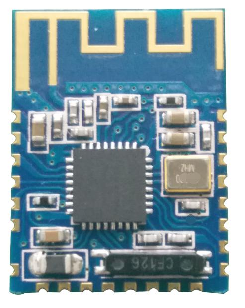
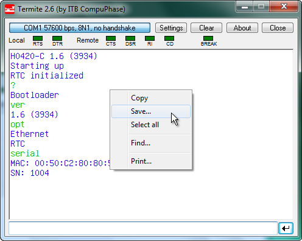

# JDY-16 High Speed Transparent Transmission Bluetooth Module

WeChat Transparent Transmission, APP Transparent Transmission, Master-slave integration, iBeacon
Module version number：JDY-16-V1.2

[Table of contents](#table-of-contents)

**JDY-16 Version** supports (WeChat, APP, Android) Transparent Transmission, IO, RTC, PWM and other functions

**JDY-16M version** supports MESH networking, IO, RTC, PWM and other functions

**Note: the same hardware of JDY-16 is divided into two sets of version software,and the version that ends with M supports MESH networking.**

**This manual is the JDY-16 version manual.**

# Table of contents
- [Version](#version)
- [JDY debugging tool](#jdy-debugging-tool)
- [Product brief introduction](#product-brief-introduction)
- [Brief introduction of the function](#brief-introduction-of-the-function)
- [Electrical characteristics](#electrical-characteristics)
- [Description of JDY-16 sleep mode](#description-of-jdy-16-sleep-mode)
- [FAQ](#faq)
- [Technical parameter](#technical-parameter)
- [Default parameter configuration for factory](#default-parameter-configuration-for-factory)
- [Dimensional drawing](#dimensional-drawing)
- [Pin definition](#pin-definition)
- [Pin function description](#pin-function-description)
- [Serial port AT instruction set](#serial-port-at-instruction-set)
- [AT instruction description](#at-instruction-description)
	- [Settings / Queries - APP permission](#settings--queries---app-permission)
	- [Soft reset](#soft-reset)
	- [Settings / Queries - Device style](#settings--queries---device-style)
	- [Restore factory configuration (revert to factory default configuration Parameter)](#restore-factory-configuration-revert-to-factory-default-configuration-parameter)
	- [Settings / Queries - Boot sleep and wake up reading and writing](#settings--queries---boot-sleep-and-wake-up-reading-and-writing)
	- [Settings / Queries - Sleep Instruction (can broadcast under sleep state)](#settings--queries---sleep-instruction-can-broadcast-under-sleep-state)
	- [Settings / Queries - Baud rate](#settings--queries---baud-rate)
	- [Settings -  Disconnect](#settings----disconnect)
	- [Settings / Queries - Broadcast switch](#settings--queries---broadcast-switch)
	- [Settings / Queries - Mode work pattern](#settings--queries---mode-work-pattern)
	- [Settings / Queries - Broadcast interval](#settings--queries---broadcast-interval)
	- [Settings / Queries - Broadcast name](#settings--queries---broadcast-name)
	- [Settings / Queries - MAC address (The MAC address of the module can be changed)](#settings--queries---mac-address-the-mac-address-of-the-module-can-be-changed)
	- [Settings / Queries - Transmit power](#settings--queries---transmit-power)
	- [iBeacon (iBeacon mode Instruction)](#ibeacon-ibeacon-mode-instruction)
		- [Settings / Queries - iBeacon UUID (iBeacon mode Instruction)](#settings--queries---ibeacon-uuid-ibeacon-mode-instruction)
		- [Settings / Queries - iBeacon Major (iBeacon mode Instruction)](#settings--queries---ibeacon-major-ibeacon-mode-instruction)
		- [Settings / Queries - iBeacon Minor (iBeacon mode Instruction)](#settings--queries---ibeacon-minor-ibeacon-mode-instruction)
		- [Settings / Queries - iBeacon IBSING (iBeacon mode Instruction)](#settings--queries---ibeacon-ibsing-ibeacon-mode-instruction)
		- [Queries - Version number (iBeacon mode Instruction)](#queries---version-number-ibeacon-mode-instruction)
	- [Settings / Queries - Manufacturer identification code (iBeacon mode Instruction)](#settings--queries---manufacturer-identification-code-ibeacon-mode-instruction)
	- [Settings / Queries - Password connection switch](#settings--queries---password-connection-switch)
	- [Settings / Queries - Connection password](#settings--queries---connection-password)
	- [Settings / Queries - Service UUID (Service UUID in APP data communication)](#settings--queries---service-uuid-service-uuid-in-app-data-communication)
	- [Settings / Queries - Feature UUID (Service UUID in APP data communication)](#settings--queries---feature-uuid-service-uuid-in-app-data-communication)
	- [Settings - Master scan](#settings---master-scan)
	- [Settings / Queries - Master connect slave](#settings--queries---master-connect-slave)
	- [Settings / Queries - Master binding MAC address](#settings--queries---master-binding-mac-address)
	- [Settings - Master cancels binding](#settings---master-cancels-binding)
	- [Settings / Queries - Connection state](#settings--queries---connection-state)
	- [RTC](#rtc)
		- [Settings / Queries - RTC year/month/time/minute/second](#settings--queries---rtc-yearmonthtimeminutesecond)
		- [Settings / Queries - RTC open & close](#settings--queries---rtc-open--close)
	- [Settings / Queries - WeChat H5 or server selection](#settings--queries---wechat-h5-or-server-selection)
	- [PWM](#pwm)
		- [Settings / Queries - PWM frequency](#settings--queries---pwm-frequency)
		- [Settings / Queries - Open & close PWM](#settings--queries---open--close-pwm)
		- [Settings / Queries - PWM1 pulse width](#settings--queries---pwm1-pulse-width)
		- [Settings / Queries - PWM2 pulse width](#settings--queries---pwm2-pulse-width)
		- [Settings / Queries - PWM3 pulse width](#settings--queries---pwm3-pulse-width)
		- [Settings / Queries - PWM4 pulse width](#settings--queries---pwm4-pulse-width)
	- [Settings / Queries - Serial port parity check bit](#settings--queries---serial-port-parity-check-bit)
	- [Settings / Queries - WeChat (automatic, manual) test mode](#settings--queries---wechat-automatic-manual-test-mode)
	- [Settings / Queries - Broadcast indicating LED lamp](#settings--queries---broadcast-indicating-led-lamp)
- [IIC communication format](#iic-communication-format)
- [Mobile terminal instructions](#mobile-terminal-instructions)
	- [APP UUID list](#app-uuid-list)
	- [APP command usage instructions (IO)](#app-command-usage-instructions-io)
		- [1. APP transparent transmission (using feature UUID:FFE2)](#1-app-transparent-transmission-using-feature-uuidffe2)
		- [2. APP control IO port (using feature UUID:FFE2)](#2-app-control-io-port-using-feature-uuidffe2)
		- [3. APP setting and reading iBeacon UUID (using feature UUID:FFE2)](#3-app-setting-and-reading-ibeacon-uuid-using-feature-uuidffe2)
		- [4. APP setting iBeacon MAJOR (using feature UUID:FFE2)](#4-app-setting-ibeacon-major-using-feature-uuidffe2)
		- [5. APP setting iBeacon MINOR (using feature UUID:FFE2)](#5-app-setting-ibeacon-minor-using-feature-uuidffe2)
		- [6. APP setting iBeacon SING (using feature UUID:FFE2)](#6-app-setting-ibeacon-sing-using-feature-uuidffe2)
		- [7. APP sets Bluetooth broadcast name (using feature UUID:FFE2)](#7-app-sets-bluetooth-broadcast-name-using-feature-uuidffe2)
		- [8. APP setting and read Connection password (use feature UUID:FFE2)](#8-app-setting-and-read-connection-password-use-feature-uuidffe2)
		- [9. APP reset Bluetooth module (use feature UUID:FFE2)](#9-app-reset-bluetooth-module-use-feature-uuidffe2)
		- [10. APP request hardware active disconnect from APP (use feature UUID:FFE2)](#10-app-request-hardware-active-disconnect-from-app-use-feature-uuidffe2)
		- [11. APP read module version (using feature UUID:FFE2)](#11-app-read-module-version-using-feature-uuidffe2)
		- [12. APP read module MAC address (using feature UUID:FFE2)](#12-app-read-module-mac-address-using-feature-uuidffe2)
		- [13. APP control PWM switch (using feature UUID:FFE2)](#13-app-control-pwm-switch-using-feature-uuidffe2)
- [JDY-16 basic application wiring diagram](#jdy-16-basic-application-wiring-diagram)
	- [1. Wiring diagram of serial port communication mode](#1-wiring-diagram-of-serial-port-communication-mode)
	- [2. Wiring diagram of IIC communication mode](#2-wiring-diagram-of-iic-communication-mode)
	- [3. IO control wiring diagram](#3-io-control-wiring-diagram)
	- [4. PWM control wiring diagram](#4-pwm-control-wiring-diagram)

## Version
Brief function introduction of JDY-16-V1.2 version
1. BLE high speed transparent transmission supports 8K Bytes rate communication
2. Send and receive data without byte limit, support 115200 baud rate continuously send and receive data
3. Support 3 modes of work (see the description of AT+STARTEN instruction function)
4. Support (serial port, IO, APP) sleep wake up
5. Support WeChat Airsync, WeChat applet and APP communication
6. Support 4 channel IO port control
7. Support high precision RTC clock
8. Support PWM function (can be controlled by UART, IIC, APP, etc.)
9. Support UART and IIC communication mode, default to UART communication

[TOC](#table-of-contents)

## JDY debugging tool
[:link: Termite](https://www.compuphase.com/software_termite.htm): a simple RS232 terminal:

[:link: Null-modem emulator (com0com)](http://com0com.sourceforge.net/)

[.jpg)](http://com0com.sourceforge.net/)

[TOC](#table-of-contents)

## Product brief introduction
The JDY-16 transmission module is based on Bluetooth 4.2 standard, the working frequency is 2.4GHZ, the modulation mode is GFSK, the maximum transmission power is 0db, and the maximum transmission distance is 80 meters, using imported original chip design, which supports users to modify the name of the device, service UUID, transmit power, pairing passwords and other instructions through the AT command, convenient and flexible to use.

[TOC](#table-of-contents)

## Brief introduction of the function
1. WeChat transparent transmission (support for AirSync protocol, applied to WeChat H5 or manufacturer server communication)
2. Support WeChat applet
3. APP transparent transmission (support for Android and IOS data transparent transmission)
4. IBeacon mode (support for WeChat shake protocol and apple iBeacon protocol)
5. Master transparent transmission mode (inter-module data transparent transmission, Master communicate with slave)
6. IO mode (applied to mobile phone control relay or LED lighting)
7. RTC function
8. PWM support (APP, IIC, APP, WeChat applet) control

[TOC](#table-of-contents)

## Electrical characteristics
| Working mode                | Broadcast state           | Current | Remarks   |
|-----------------------------|---------------------------|---------|-----------|
| Wake up                     | Broadcast                 |   4.9mA | Remark #1 |
| Deep no broadcast sleep     | No broadcast              |  1.38uA | Remark #1 |
| Light sleep broadcast sleep |  100ms broadcast interval |   180uA | Remark #1 |
| Average power consumption   |  200ms broadcast interval |    80uA | Remark #1 |
| Average power consumption   |  300ms broadcast interval |    40uA | Remark #1 |
| Average power consumption   |  400ms broadcast interval | << 40uA | Remark #1 |
| Average power consumption   |  500ms broadcast interval | << 40uA | Remark #1 |
| Average power consumption   |  600ms broadcast interval | << 40uA | Remark #1 |
| Average power consumption   |  700ms broadcast interval | << 40uA | Remark #1 |
| Average power consumption   |  800ms broadcast interval | << 40uA | Remark #1 |
| Average power consumption   |  900ms broadcast interval | << 40uA | Remark #1 |
| Average power consumption   | 1000ms broadcast interval | << 40uA | Remark #1 |
| Wake up state               | Connected                 |  4.93mA | Remark #2 |
| Sleep state                 | Connected                 |    50uA | Remark #2 |

**Remarks**
1. Generally communicate with APP connection, it suggests broadcast should not be set too long, which will affect the connection time. It is generally recommended between 100 to 500mS, and if you need to connect fast and no power requirements, broadcast intervals can be set to the shortest.
2. Under connection state, the AT command can be pulled down by PWRC pin or the working mode is set directly, please see the AT+STARTEN instructions

[TOC](#table-of-contents)

## Description of JDY-16 sleep mode
AT instruction: [AT+STARTEN](#settings--queries---boot-sleep-and-wake-up-reading-and-writing)
- **Mode 0**
  Wake up, users need sleep can be controlled by AT+SLEEP command, wake up can be controlled by PWRC pin wake-up.
- **Mode 1**
  Boot sleep, wake up after the connection, disconnect automatically into sleep.
	**Note: AT+SLEEP invalid mode 1, sleep controls sleep by Bluetooth module itself.**

- **Mode 2**
  Boot sleep, connect and disconnect all sleep, APP to send data to the serial port module or module to send data automatic wake-up, after data transmission is completed, it will be automatic sleep.
	**Note: AT+SLEEP of mode 1 is invalid.**
	**Note: AT+SLEEP invalid mode 1, sleep controls sleep by Bluetooth module itself.**

[TOC](#table-of-contents)

## FAQ
1. **How does MCU disconnect Bluetooth connection under connection state?**
   In the connection state, the PWRC pin is pulled down, and the serial port sends AT+DISC to disconnect the connection
	 IIC can disconnect the memory address: 0X15 writes 0X01 values to indicate disconnection
2. **Can it write data to the module if the connection password is incorrect?**
   No, it can’t. Only the correct password can write data to the module
3. **How much data can the serial port write at one time?**
   No byte limit, 100K can be sent once
4. **How fast can the fastest communication rate be reached?**
   With mobile phone measured 8K Bytes per second, module master slave communication can achieve 115200 baud rate continuous transceiver, and the rate of 115200bps.
5. **After configuring parameters by serial port or IIC, does it need to be restarted to take effect?**
   It is recommended to restart when the module parameters are set.
6. **Parameters of serial port or IIC configuration, is the power up stored next time?**
   After saving, configuring, the next power up is the last configuration parameter.

[TOC](#table-of-contents)

## Technical parameter
1. Serial transmission without byte limitation during transparent and transmission
2. The effective communication distance is less than 80 meters
3. Working temperature -40 ~ +80ºC
4. The communication rate is 8K Bytes per second
5. Support the communication between UART and IIC
6. Working voltage 1.8 - 3.3V

[TOC](#table-of-contents)

## Default parameter configuration for factory
1. Communication mode: UART（**SELECT pin hanging**）
2. Serial port baud rate: 9600（**AT+BAUD4**）
3. Sleep mode: boot sleep, connection wake up（**AT+STARTEN1**）
4. Broadcast name: JDY-16 (**AT+NAMEJDY-16**）
5. Broadcast interval: 200MS（**AT+ADVIN2**）
6. Master slave mode: slave transparent transmission (**AT+MASTEREN0**）
7. Output status: connection or disconnection status output from serial port (**AT+ENLOG1**）
8. Broadcast LED indicator pin open AT+ALED1）

**If the default configuration parameters above cannot meet the requirements, you can contact the service or FAE**

[TOC](#table-of-contents)

## Dimensional drawing

[TOC](#table-of-contents)

## Pin definition

[TOC](#table-of-contents)

## Pin function description
|Pin | Function  | Description                                                                                                                                                                                                                                                                                     |
|---:|-----------|-------------------------------------------------------------------------------------------------------------------------------------------------------------------------------------------------------------------------------------------------------------------------------------------------|
|  1 | VCC       | Power supply (1.8-3.3V)                                                                                                                                                                                                                                                                         |
|  2 | PWM1      | Support UART, IIC, APP control                                                                                                                                                                                                                                                                  |
|  3 | PWM2      | Support UART, IIC, APP control                                                                                                                                                                                                                                                                  |
|  4 | IO4       | High and low electrical level can be controlled by APP                                                                                                                                                                                                                                          |
|  5 | NULL      |                                                                                                                                                                                                                                                                                                 |
|  6 | STAT      | **UART communication mode**: not connected low electrical level, high electrical level after connection.  **IIC communication mode**: not connected high electrical level, connection, disconnect or receive data will work in interrupt mode, interrupt the falling edge holding time 200ms |
|  7 | NULL      |                                                                                                                                                                                                                                                                                                 |
|  8 | NULL      |                                                                                                                                                                                                                                                                                                 |
|  9 | IO1       | High and low electrical level can be controlled by APP                                                                                                                                                                                                                                          |
| 10 | IO2       | High and low electrical level can be controlled by APP                                                                                                                                                                                                                                          |
| 11 | NULL      |                                                                                                                                                                                                                                                                                                 |
| 12 | NULL      |                                                                                                                                                                                                                                                                                                 |
| 13 | IO3       | High and low electrical level can be controlled by APP                                                                                                                                                                                                                                          |
| 14 | PWM3      | Support UART, IIC, APP control                                                                                                                                                                                                                                                                  |
| 15 | PWM4      | Support UART, IIC, APP control                                                                                                                                                                                                                                                                  |
| 16 | NULL      |                                                                                                                                                                                                                                                                                                 |
| 17 | ALED      | Broadcast flashes, always bright after connection (master-slave effective)                                                                                                                                                                                                                      |
| 18 | RTCA      | RTC timing time to produce a drop edge interrupt signal, usually high electrical level                                                                                                                                                                                                          |
| 19 | TXD_OR_DD | SELECT boot to low electrical level, the pin function of this serial port is TXD  SELECT boot to low electrical level, this pin function is IIC DD                                                                                                                                           |
| 20 | RXD_OR_DC | SELECT boot to low electrical level, the pin function of this serial port is TXD  SELECT boot to low electrical level, this pin function is IIC DD                                                                                                                                           |
| 21 | SELECT    | UART or IIC select pin  Boot low electrical level: IIC communication mode  Boot high electrical level: UART communication mode  The default SELECT is suspended as high electrical level: UART communication mode, when the user needs IIC, the SELECT pin is required to be grounded  |
| 22 | PWRC      | When the AT instruction is required to be sent in the connection state, the AT instruction mode can be displayed by maintaining the low electrical level of the pin. In the unconnected state, this pin is AT command mode regardless of the high and low electrical levels                     |
| 23 | RESET     | Hardware reset pin                                                                                                                                                                                                                                                                              |
| 24 | GND       | Power ground                                                                                                                                                                                                                                                                                    |

[TOC](#table-of-contents)

## Serial port AT instruction set
:warning: JDY-16 module serial port send AT instruction must add \r\n, AT does not distinguish case

| Seq. | Instruction | Function                                    | Master / Slave | Work mode                  | Default                          |
|------|-------------|---------------------------------------------|:--------------:|----------------------------|----------------------------------|
|   1  | AT+PERM     | APP permission configuration                |       S        |                            | IO, PWM open                     |
|   2  | AT+RST      | Reset                                       |      M/S       | -                          |                                  |
|   3  | AT+MASTEREN | Master-slave setting                        |      M/S       | -                          | slave                            |
|   4  | AT+MAC      | Device MAC                                  |      M/S       | -                          |                                  |
|   5  | AT+BAUD     | Baud rate                                   |      M/S       | -                          | 9600                             |
|   6  | AT+NAME     | Broadcast name                              |       S        |                            | JDY-16                           |
|   7  | AT+CONN     | Master connect slave                        |       M        |                            |                                  |
|   8  | AT+SCAN     | Master scan slave                           |       M        |                            |                                  |
|   9  | AT+BAND     | Master binding slave MAC                    |       M        |                            | 000000000000                     |
|  10  | AT+USTP     | Serial port stop bit                        |      M/S       |                            | 0                                |
|  11  | AT+SLEEP    | Sleep                                       |      M/S       |                            |                                  |
|  12  | AT+PARITY   | Serial port parity check bit                |      M/S       |                            | 0                                |
|  13  | AT+PASS     | Slave connection password                   |       S        |                            | 123456                           |
|  14  | AT+STARTEN  | Start working mode                          |      M/S       |                            | 0                                |
|  15  | AT+DEFAULT  | Restore factory configuration               |      M/S       |                            |                                  |
|  16  | AT+FLOWC    | Serial port flow control                    |      M/S       |                            | 0                                |
|  17  | AT+VER      | Version number                              |      M/S       |                            |                                  |
|  18  | AT+ISCEN    | Slave connection password switch            |      M/S       |                            | 0                                |
|  19  | AT+ WXSVR   | WeChat Airsync H5 or server                 |       S        | transp arent trans mission | 0                                |
|  20  | AT+WXINEN   | Manual and automatic test of WeChat Airsync |       S        | transp arent trans mission | 0                                |
|  21  | AT+ CLSS    | Device style                                |       S        |                            | A0                               |
|  22  | AT+VID      | Manufacturer ID identification code         |       S        |                            |                                  |
|  23  | AT+MAJOR    | iBeacon MAJOR value                         |       S        | iBeacon                    | 0A                               |
|  24  | AT+MINOR    | iBeacon MINOR value                         |       S        | iBeacon                    | 07                               |
|  25  | AT+IBUUID   | iBeacon UUID value                          |       S        | iBeacon                    | FDA50693A4E24FB1AFCFC6EB07647825 |
|  26  | AT+IBSING   | iBeacon SING value                          |       S        | iBeacon                    | 40                               |
|  27  | AT+SVRUUID  | Bluetooth service UUID                      |      M/S       | transp arent trans mission | FFE0                             |
|  28  | AT+CHRUUID  | Bluetooth feature UUID                      |      M/S       | transp arent trans mission | FFE1                             |
|  29  | AT+ADVIN    | Broadcast interval                          |       S        |                            | 1                                |
|  30  | AT+ADVEN    | Broadcast switch                            |       S        |                            | 1                                |
|  31  | AT+RTCOPEN  | RTC switch                                  |      M/S       |                            | 0                                |
|  32  | AT+RTCD     | RTC time read & write                       |      M/S       |                            | 2016-01-01,00:00:00              |
|  33  | AT+POWR     | Transmitting power                          |       S        |                            | 1                                |
|  34  | AT+DISC     | Disconnect                                  |       S        |                            |                                  |
|  35  | AT+STAT     | Connection state                            |      M/S       |                            | 00                               |
|  36  | AT+ENLOG    | State output enable                         |      M/S       |                            | 0                                |
|  37  | AT+PWMFRE   | PWM frequency                               |      M/S       |                            | 1000                             |
|  38  | AT+PWMOPEN  | PWM switch                                  |      M/S       |                            | 0                                |
|  39  | AT+PWM1PUS  | PWM1 pulse width                            |      M/S       |                            | 10                               |
|  40  | AT+PWM2PUS  | PWM2 pulse width                            |      M/S       |                            | 10                               |
|  41  | AT+PWM3PUS  | PWM3 pulse width                            |      M/S       |                            | 10                               |
|  42  | AT+PWM4PUS  | PWM4 pulse width                            |      M/S       |                            | 10                               |
|  43  | AT+ALED     | Broadcast  indicating  LED switch           |      M/S       |                            | Open                             |

[TOC](#table-of-contents)

## AT instruction description
**Special note: JDY-16 module serial port instruction AT need to add terminator \r\n**

### Settings / Queries - APP permission
| Instruction     | Response       | Parameter          |
|-----------------|----------------|--------------------|
| AT+PERM\<Param> | +OK            | Param (5 bit byte) |
| AT+PERM         | +PERM=\<Param> |                    |

Each byte function in 5 bytes is explained in detail

| Param | Function                                        | Permission (Y/N) |
|-------|-------------------------------------------------|------------------|
| Byte1 | Can broadcast be modified by APP?               | Default: N       |
| Byte2 | Can the connection password be modified by APP? | Default: N       |
| Byte3 | Can the APP control the IO electrical level?    | Default: Y       |
| Byte4 | Can APP control PWM?                            | Default: Y       |
| Byte5 | Can APP configure iBeacon Parameter?            | Default: N       |

Y indicates that APP has permission control
N indicates APP without permission control

The above configuration Parameter sends AT+PERM, returns Parameter is: +PERM=00110
The example opens the APP settings (broadcast name, IO, PWM) permissions
Send： AT+PERM10110

[TOC](#table-of-contents)

### Soft reset
| Instruction     | Response       | Parameter |
|-----------------|----------------|-----------|
| AT+RST          | +OK            | None      |

[TOC](#table-of-contents)

### Settings / Queries - Device style
| Instruction     | Response       | Parameter                       |
|-----------------|----------------|---------------------------------|
| AT+CLSS\<Param> | +OK            | Param (00-FF)  Default: 0xA0 |
| AT+CLSS         | +CLSS=\<Param> |                                 |

[TOC](#table-of-contents)

### Restore factory configuration (revert to factory default configuration Parameter)
| Instruction     | Response       | Parameter          |
|-----------------|----------------|--------------------|
| AT+DEFAULT      | +OK            | None               |

[TOC](#table-of-contents)

### Settings / Queries - Boot sleep and wake up reading and writing
| Instruction        | Response          | Parameter                   |
|--------------------|-------------------|-----------------------------|
| AT+STARTEN\<Param> | +OK               | Param (0-2)  Default: 0  |
| AT+STARTEN         | +STARTEN=\<Param> |                             |

**Param:**
| Value | Description                                                                                           |
|-------|-------------------------------------------------------------------------------------------------------|
|   0   | Wake up, sleep can be controlled by AT+SLEEP                                                          |
|   1   | Boot sleep, connect wake up, disconnect sleep                                                         |
|   2   | Boot sleep, connect sleep, disconnect sleep.  Auto wakeup when sending data by APP or serial port  |

[Description of JDY-16 sleep mode](#description-of-jdy-16-sleep-mode)

[TOC](#table-of-contents)

### Settings / Queries - Sleep Instruction (can broadcast under sleep state)
| Instruction      | Response  | Parameter   |
|------------------|-----------|-------------|
| AT+SLEEP\<Param> | +SLEEP:OK | Param (1-2) |
| AT+SLEEP         | +SLEEP:OK |             |

**Param:**
| Value | Description               |
|-------|---------------------------|
|   1   | light sleep (Broadcast)   |
|   2   | deep sleep (No Broadcast) |

[TOC](#table-of-contents)

### Settings / Queries - Baud rate
:warning: **Note: the default baud rate of the module is: 115200**
| Instruction     | Response       | Parameter                  |
|-----------------|----------------|----------------------------|
| AT+BAUD\<Param> | +OK            | Param (1-9)  Default: 0 |
| AT+BAUD         | +BAUD=\<Param> |                            |

**Param:**
| Value | Baud rate |
|-------|----------:|
|   1   |      1200 |
|   2   |      2400 |
|   3   |      4800 |
|   4   |      9600 |
|   5   |     19200 |
|   6   |     38400 |
|   7   |     57600 |
|   8   |    115200 |
|   9   |    230400 |

[TOC](#table-of-contents)

### Settings -  Disconnect
| Instruction     | Response       | Parameter          |
|-----------------|----------------|--------------------|
| AT+DISC      | +OK            | None               |

[TOC](#table-of-contents)

### Settings / Queries - Broadcast switch
| Instruction      | Response        | Parameter                  |
|------------------|-----------------|----------------------------|
| AT+ADVEN\<Param> | +OK             | Param (0-1)  Default: 1 |
| AT+ADVEN         | +ADVEN=\<Param> |                            |

**Param:**
| Value | Description    |
|-------|----------------|
|   0   | Stop Broadcast |
|   1   | Open Broadcast |

[TOC](#table-of-contents)

### Settings / Queries - Mode work pattern
| Instruction         | Response           | Parameter                  |
|---------------------|--------------------|----------------------------|
| AT+MASTEREN\<Param> | +OK                | Param (0-3)  Default: 0 |
| AT+MASTEREN         | +MASTEREN=\<Param> |                            |

**Param:**
| Value | Description                                                 |
|-------|-------------------------------------------------------------|
|   0   | Slave (APP, WeChat, small program) transparent transmission |
|   1   | Master transparent transmission mode                        |
|   3   | Slave (iBeacon) mode                                        |

[TOC](#table-of-contents)

### Settings / Queries - Broadcast interval
| Instruction      | Response        | Parameter                  |
|------------------|-----------------|----------------------------|
| AT+ADVIN\<Param> | +OK             | Param (0-9)  Default: 0 |
| AT+ADVIN         | +ADVIN=\<Param> |                            |

**Param:**
| Value | Description |
|-------|------------:|
|   0   |     100ms   |
|   1   |     200ms   |
|   2   |     300ms   |
|   3   |     400ms   |
|   4   |     500ms   |
|   5   |     600ms   |
|   6   |     700ms   |
|   7   |     800ms   |
|   8   |     900ms   |
|   9   |    1000ms   |

[TOC](#table-of-contents)

### Settings / Queries - Broadcast name

[TOC](#table-of-contents)

### Settings / Queries - MAC address (The MAC address of the module can be changed)

[TOC](#table-of-contents)

### Settings / Queries - Transmit power

[TOC](#table-of-contents)

### iBeacon (iBeacon mode Instruction)
#### Settings / Queries - iBeacon UUID (iBeacon mode Instruction)

[TOC](#table-of-contents)

#### Settings / Queries - iBeacon Major (iBeacon mode Instruction)

[TOC](#table-of-contents)

#### Settings / Queries - iBeacon Minor (iBeacon mode Instruction)

[TOC](#table-of-contents)

#### Settings / Queries - iBeacon IBSING (iBeacon mode Instruction)

[TOC](#table-of-contents)

#### Queries - Version number (iBeacon mode Instruction)

[TOC](#table-of-contents)

### Settings / Queries - Manufacturer identification code (iBeacon mode Instruction)

[TOC](#table-of-contents)

### Settings / Queries - Password connection switch

[TOC](#table-of-contents)

### Settings / Queries - Connection password

[TOC](#table-of-contents)

### Settings / Queries - Service UUID (Service UUID in APP data communication)

[TOC](#table-of-contents)

### Settings / Queries - Feature UUID (Service UUID in APP data communication)

[TOC](#table-of-contents)

### Settings - Master scan

[TOC](#table-of-contents)

### Settings / Queries - Master connect slave

[TOC](#table-of-contents)

### Settings / Queries - Master binding MAC address

[TOC](#table-of-contents)

### Settings - Master cancels binding

[TOC](#table-of-contents)

### Settings / Queries - Connection state

[TOC](#table-of-contents)

### RTC
#### Settings / Queries - RTC year/month/time/minute/second

[TOC](#table-of-contents)

#### Settings / Queries - RTC open & close

[TOC](#table-of-contents)

### Settings / Queries - WeChat H5 or server selection

[TOC](#table-of-contents)

### PWM
#### Settings / Queries - PWM frequency

[TOC](#table-of-contents)

#### Settings / Queries - Open & close PWM

[TOC](#table-of-contents)

#### Settings / Queries - PWM1 pulse width

[TOC](#table-of-contents)

#### Settings / Queries - PWM2 pulse width

[TOC](#table-of-contents)

#### Settings / Queries - PWM3 pulse width

[TOC](#table-of-contents)

#### Settings / Queries - PWM4 pulse width

[TOC](#table-of-contents)

### Settings / Queries - Serial port parity check bit

[TOC](#table-of-contents)

### Settings / Queries - WeChat (automatic, manual) test mode

[TOC](#table-of-contents)

### Settings / Queries - Broadcast indicating LED lamp

[TOC](#table-of-contents)

## IIC communication format

[TOC](#table-of-contents)

## Mobile terminal instructions
### APP UUID list
- Service UUID: FFE0 (Service UUID default FFE0 user can change)
-	Feature UUID: FFE1 (For transparent transmission default ffe1 users can change)
- Feature UUID: FFE2 (For module function configuration)

[TOC](#table-of-contents)

### APP command usage instructions (IO)
#### 1. APP transparent transmission (using feature UUID:FFE2)
0XFFE1 is the APP transparent transmission characteristic of UUID (It is applied to IOS, Android or WeChat applet communication)

[TOC](#table-of-contents)

#### 2. APP control IO port (using feature UUID:FFE2)

[TOC](#table-of-contents)

#### 3. APP setting and reading iBeacon UUID (using feature UUID:FFE2)

[TOC](#table-of-contents)

#### 4. APP setting iBeacon MAJOR (using feature UUID:FFE2)

[TOC](#table-of-contents)

#### 5. APP setting iBeacon MINOR (using feature UUID:FFE2)

[TOC](#table-of-contents)

#### 6. APP setting iBeacon SING (using feature UUID:FFE2)

[TOC](#table-of-contents)

#### 7. APP sets Bluetooth broadcast name (using feature UUID:FFE2)

[TOC](#table-of-contents)

#### 8. APP setting and read Connection password (use feature UUID:FFE2)

[TOC](#table-of-contents)

#### 9. APP reset Bluetooth module (use feature UUID:FFE2)

[TOC](#table-of-contents)

#### 10. APP request hardware active disconnect from APP (use feature UUID:FFE2)

[TOC](#table-of-contents)

#### 11. APP read module version (using feature UUID:FFE2)

[TOC](#table-of-contents)

#### 12. APP read module MAC address (using feature UUID:FFE2)

[TOC](#table-of-contents)

#### 13. APP control PWM switch (using feature UUID:FFE2)

[TOC](#table-of-contents)

## JDY-16 basic application wiring diagram
### 1. Wiring diagram of serial port communication mode

[TOC](#table-of-contents)

### 2. Wiring diagram of IIC communication mode
Low cost MCU without UART can be connected by IIC mode.

[TOC](#table-of-contents)

### 3. IO control wiring diagram
It is applied to switch control and other applications.

[TOC](#table-of-contents)

### 4. PWM control wiring diagram
It is applied to motor high speed and LED lamp PWM control.

[TOC](#table-of-contents)
