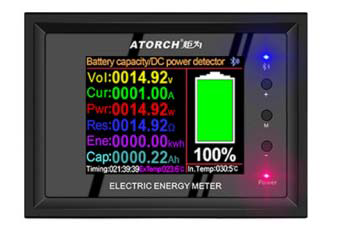
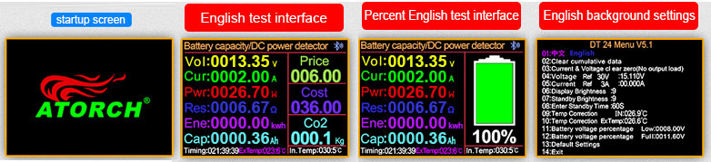
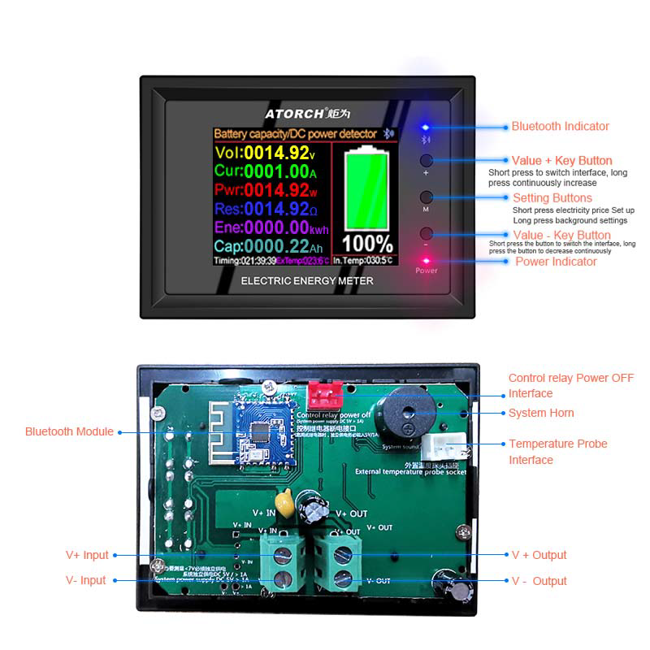
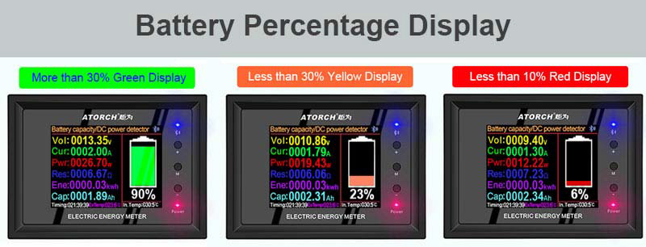

# DT24 Series User Manual

2.4-inch HD color screen Bluetooth digital transmission curve version battery capacity / DC power multi-function tester

(This product will be updated at any time, please pay attention to the web page description for detailed update details)

[DT24 User Manual (pdf)](DT24-DT24P/DT24%20User%20manual.pdf)

# Table of contents
- [Product Parameter](#product-parameter)

## Product description:

DT24 2.4inch HD color screen DC meter, Torch is developed by engineers using a number of black technology, and all details are comprehensively upgraded.

[TOC](#table-of-contents)

## Product application:

This product is used to test the capacity of various batteries, discharge and age various power adapters, and detect the voltage, current, and other parameters of various DC power supplies.

[TOC](#table-of-contents)

## Product Parameter

### Product Size:

- Installation size: length 76mm X width 53mm
- Panel size: length 85.7mm X width 63mm

### Electrical parameters:

- Voltage measurement range under test voltage power supply mode: 7 - 380V
- Voltage measurement range in independent voltage supply mode: 0 - 380V
- Measuring power range: 0 - 11400 W (0 - 11.4 kW)
- Measuring current range: 0 - 30A

**Reminder:**
If you enable the external power-off relay, please be sure to supply the system with independent power supply 5V/>1A power supply to avoid the failure of the relay control current and system instability

[TOC](#table-of-contents)

## Functional test interface

[TOC](#table-of-contents)

## Key Botton operate Description

1. By “+” or “-” key button, you can switch between different function interface test interface
2. Long press the "M" key button to enter the product background settings, long time press the button again to return to the test interface!
3. In the main interface, click the "M" key button, the value of 000.00 will flash, and through the"+" or "- " key button, you can set different electricity bill values.
4. Switch between Chinese and English: Long time press the "M" key button, you can enter the product background settings, through the "+" or "- " key button, you can adjust the Chinese or English interface!

[TOC](#table-of-contents)

## Panel introduction

[TOC](#table-of-contents)

## Battery percentage

[TOC](#table-of-contents)

## Compatible with the current mainstream four online APPS

(Android/IOS/PC system) Online Testing

### Apple Mobile APP:

Please search for [E_test](https://apps.apple.com/app/e-test/id1478623332) in the [Apple store](https://apps.apple.com) to download and install, then click the Bluetooth APP icon to open the software, and then click the Bluetooth icon above the software to enter the selection DL24-BLE to connect, you can achieve mobile phone remote wireless remote control settings and Measurement function, the discharge status can be viewed at any time on the mobile phone, various data cleaning is visible, the voltage and current power curve of the discharge, etc.

[TOC](#table-of-contents)

### Android phone APP (Only support Android 5.0 and above):

Scan the QR code on the back of the host to download the corresponding APP software or Android APP: search [E-test](https://play.google.com/store/apps/details?id=com.tang.etest.e_test) at [Google play](https://play.google.com) to down load. After the installation is complete, open the software and click the Bluetooth icon to enter the direct selection of DL24-BLE to successfully use it online. (No need for Bluetooth pairing, the software Bluetooth icon directly selects DL24. can)

Android APP Download Address: http://www.mediafire.com/folder/31bc15uhq8odb/E-meter

[TOC](#table-of-contents)

### App Connection Method

Please click this "E-test"APP to open the software

[TOC](#table-of-contents)

### Mobile App interface function introduction

[TOC](#table-of-contents)

### Computer wired online APP:

After the host is powered on, connect the USB port of the computer with the provided data cable, and then install the CH340 serial port driver, then scan the QR code on the back of the host to download the corresponding APP software. After the installation is complete, select the software you just installed and add The serial port model can be successfully used online, of course, this APP style using the installation method is also compatible with the serial port device of the Bluetooth device!

### Computer Bluetooth wireless online APP:

First add the Bluetooth device to the serial port device of DT24-SPP on the computer, then scan the QR code on the back of the host to download the corresponding APP software and store it. Open the software without installing and select the Bluetooth serial port model just added. You can successfully use online

[TOC](#table-of-contents)

## Product List
1. 2.4 inch DC color screen voltmeter X1pcs
2. Crocodile clip red black male and female X2 set
3. 2.54mm terminal temperature probe X1pcs

[TOC](#table-of-contents)
