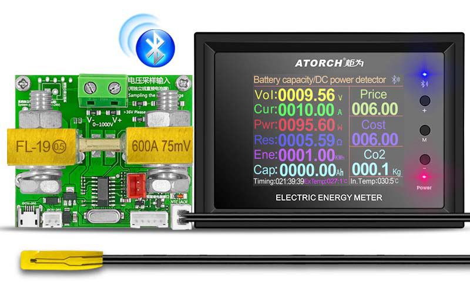
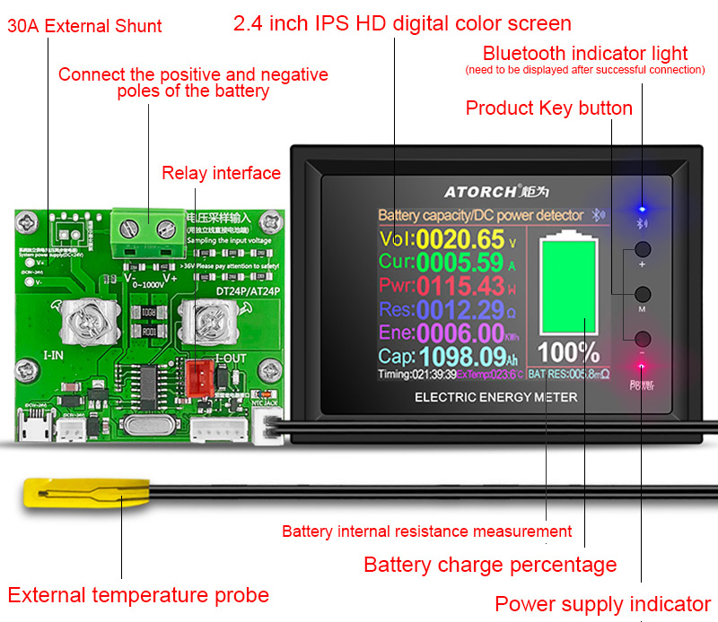
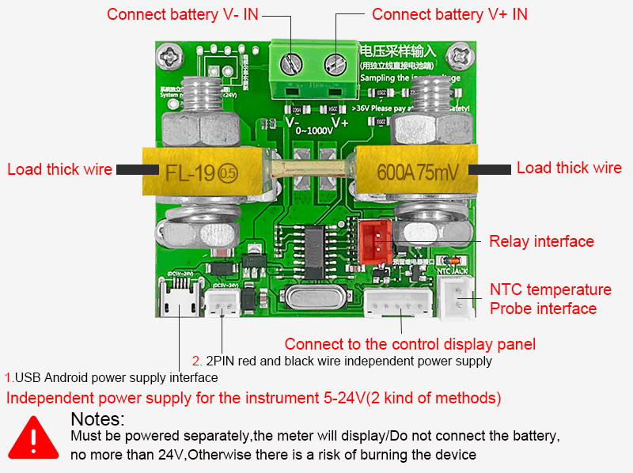
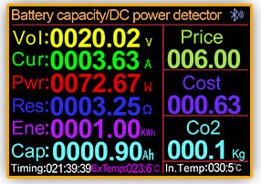
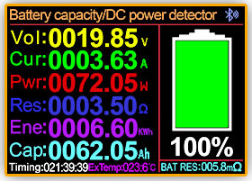
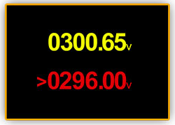
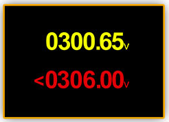
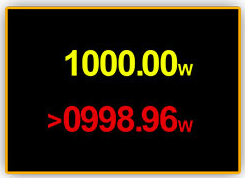
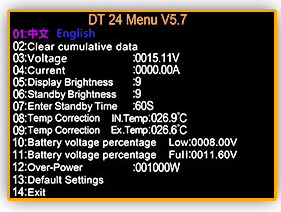
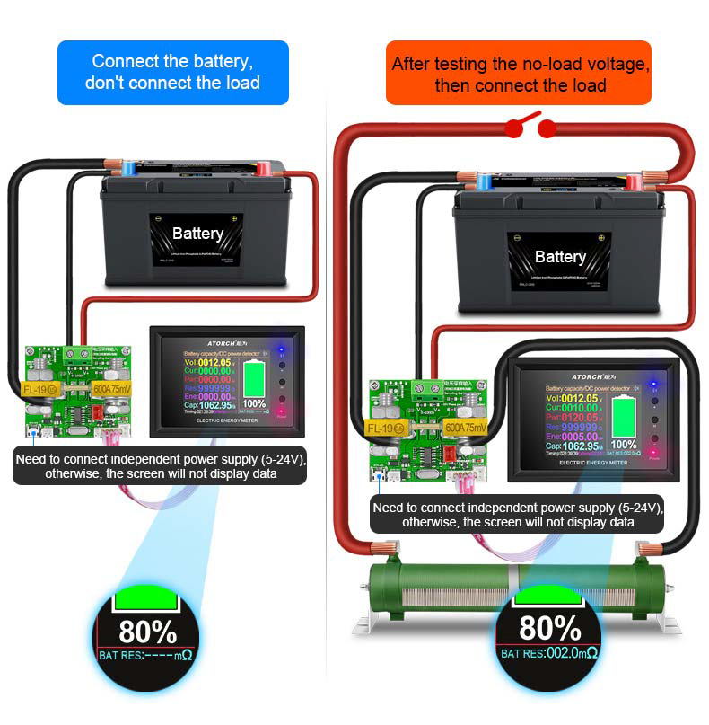

# DT24P Series User Manual
(30A/100A/200A/300A/400A/500A/600A/1000A)
2.4-inch HD color screen Bluetooth digital transmission curve version battery capacity / DC power multi-function tester

(This product will be updated at any time, please pay attention to the web page description for detailed update details)

[DT24P User Manual (pdf)](DT24-DT24P/DT24P%20User%20manual.pdf)

# Table of contents
- [Product description:](#product-description)
- [Product application:](#product-application)
- [Matters needing attention:](#matters-needing-attention)
- [Appearance structure diagram](#appearance-structure-diagram)
- [The technical parameters of different shunts are as follows](#the-technical-parameters-of-different-shunts-are-as-follows)
- [Function interface introduction:](#function-interface-introduction)
	- [Key Botton operate Description](#key-botton-operate-description)
- [Battery internal resistance internal resistance detection function](#battery-internal-resistance-internal-resistance-detection-function)
- [Compatible with the current mainstream four online APPS](#compatible-with-the-current-mainstream-four-online-apps)
	- [Apple Mobile APP:](#apple-mobile-app)
	- [Android phone APP (Only support Android 5.0 and above):](#android-phone-app-only-support-android-50-and-above)
	- [App Connection Method](#app-connection-method)
	- [Mobile App interface function introduction](#mobile-app-interface-function-introduction)
	- [Computer Bluetooth wireless online APP:](#computer-bluetooth-wireless-online-app)
- [Product List](#product-list)
	- [Product List DT24P‐30A](#product-list-dt24p30a)
	- [Product List DT24P‐100A](#product-list-dt24p100a)
	- [Product List DT24P‐200A](#product-list-dt24p200a)
	- [Product List DT24P‐300A](#product-list-dt24p300a)
	- [Product List DT24P‐400A](#product-list-dt24p400a)
	- [Product List DT24P‐500A](#product-list-dt24p500a)
	- [Product List DT24P‐600A](#product-list-dt24p600a)
	- [Product List DT24P‐1000A](#product-list-dt24p1000a)
- [Images](#images)
	- [Connection diagram](#connection-diagram)
	- [Interface display](#interface-display)
	- [Battery percentage display](#battery-percentage-display)
- [Product Image DT24P‐30A](#product-image-dt24p30a)
- [Product Image DT24P‐100A](#product-image-dt24p100a)
- [Product Image DT24P‐200A](#product-image-dt24p200a)
- [Product Image DT24P‐300A](#product-image-dt24p300a)
- [Product Image DT24P‐400A](#product-image-dt24p400a)
- [Product Image DT24P‐500A](#product-image-dt24p500a)
- [Product Image DT24P‐600A](#product-image-dt24p600a)
- [Product Image DT24P‐1000A](#product-image-dt24p1000a)

## Product description:

This product is a multifunctional type, which can be used in battery internal resistance test, capacity test, power test, voltage and current test, monitoring DC parameters, percentage power display, modification of electric vehicles, RVs and many other uses. It is universal to measure any battery, whether it is a lead-acid battery.

Is it a ternary lithium battery or lithium iron phosphate or other types of DC batteries, as long as the operating voltage range (0~1000V) is basically universal, it can be widely used for measurement, and it can also be connected wirelessly. It can be connected to mobile phone/computer inspection APP to test when installed in the car. Data, more than the set voltage alarm, less than the set voltage alarm, over power alarm and other protection settings (if you need to cut off the power, please purchase a power off relay to control the cut off the power).

Torch has once again made a breakthrough for scientific and technological engineers, designing a new model of wide voltage and high current 1000V 1000A high-power large color screen Bluetooth wireless data transmission curve version of the multi-function electric energy meter, supporting 3 major upper computer connection system APP software, Android Apple PC computer Bluetooth
Wireless connection to kill applications, all kinds of measurement parameters are readily available, adapt to a variety of measurement applications, one machine with multiple uses.

[TOC](#table-of-contents)

## Product application:

This product is used to detect the capacity of various batteries, discharge and aging various power adapters, and detect the voltage, current, and power of various DC power supplies.

[TOC](#table-of-contents)

## Matters needing attention:

- When the test power supply is higher than 36V, please install a switch and pay attention to the
safety of electricity.
- If there is a user who purchases the battery power off relay module, please be sure to query the corresponding parameters of the current battery type under test to the DT24P background menu to set the accurate low and full values, so that it will reach you during the process of discharging or charging. When the set value exceeds the range, the system will send out a control voltage. The relay will automatically disconnect the power path to prevent the battery from being over-discharged or over-charged to damage the battery (the power-off relay needs to be purchased separately).
- If you enable the external power-off relay, use as much V as the independent power supply for
the relay.
- The product must be powered independently, 5-24V DC power supply, do not input battery
power

[TOC](#table-of-contents)

## Appearance structure diagram

The display screens of different shunts of this product are the same, as shown in the figure below:

## The technical parameters of different shunts are as follows

| Model       | Current range | Power range |
|-------------|---------------|-------------|
| DT24P‐30A   |   0 ‐   30A   |  0 ‐   30kW |
| DT24P‐100A  |   0 ‐  100A   |  0 ‐  100kW |
| DT24P‐200A  |   0 ‐  200A   |  0 ‐  200kW |
| DT24P‐300A  |   0 ‐  300A   |  0 ‐  300kW |
| DT24P‐400A  |   0 ‐  400A   |  0 ‐  400kW |
| DT24P‐500A  |   0 ‐  500A   |  0 ‐  500kW |
| DT24P‐600A  |   0 ‐  600A   |  0 ‐  600kW |
| DT24P‐1000A |   0 ‐ 1000A   |  0 ‐ 1000kW |

- Independent power supply: 5‐24V
- Voltage range: 0‐1000V
- Capacity range: 0‐99999Ah
- Energy range: 0‐999999kWh
- Panel size: 85.7mm X 63mm (length X width)
- Panel install size: 75.8mm X 52.6mm (length X width)
- External shunt board size: 58mm X 50mm (length X width)

[TOC](#table-of-contents)

## Function interface introduction:
This product adopts the high-end and cost-intensive "2.4-inch high-definition large color Chinese and English display screen", designed a variety of functional interface content, Various parameters are displayed on one screen, and different function interfaces can be switched by short pressing the button. The interface diagram and introduction are as follows

1. Connect independent power supply (5-24V), the startup screen will appear

   

   1. After powering on, short press the "+"/"-" key to switch between the following function interface and battery percentage interface.

[TOC](#table-of-contents)

2. Function interface:

   

   1. Short press the "M" key to check the unit price of electricity.

   2. After entering the unit price adjustment of electricity bill, the unit price number of electricity bill jumps, press "M" shortly at this time Switch between decimal places, units, tens, and hundreds.

   3. Press "+"/"—" to adjust the number to increase/decrease.

[TOC](#table-of-contents)

3. Percentage interface:

   

   More than 30% shows green, less than 30% shows yellow, less than 10% shows red (as on the rightPicture) After setting, you can judge whether the battery is.

   The blue light will only light up when there is power.

   To display the battery percentage, you need to hold down the M key and set the maximum voltage and minimum voltage in the background to automatically calculate the current battery voltage percentage.

   

   The calculation formula is: battery percentage = (current voltage-minimum voltage) / (full charge voltage-minimum voltage) X100 %.

[TOC](#table-of-contents)

4. Low-voltage alarm reminder interface:

   

   Set a low percentage value (such as 306V), the product detects that the test voltage is lower than the setting When the value is low, this alarm reminder interface will appear.

   Tips: Set the operation method of low voltage alarm voltage

	 Press and hold the M key to enter the background, select the **battery voltage percentage low**: use the + or - key to adjust the value

[TOC](#table-of-contents)

5. High pressure alarm reminder interface:

   

	 When a high percentage value (such as 296V) is set, the product detects that the test voltage exceeds the set value.

	 When the high value, this alarm reminder interface will appear.

	 Tips: Set the operation method of low voltage alarm voltage

	 Press and hold the M key to enter the background, select the **battery voltage percentage Full**: use the + or - key to adjust the value

[TOC](#table-of-contents)

6. Over-power alarm reminder interface:

   

   When the power threshold is set (such as 998.96W), the product detects that the test power exceeds

   When the value is high, this alarm reminder interface will appear.

   Tips: Set the operation method of low voltage alarm voltage

   Press and hold the M key to enter the background, select the **Over-Power**: use the + or - key to adjust the value

[TOC](#table-of-contents)

7. System background interface:

   

   Long press the "M" key to enter the background setting, M key: switch up and down, +/- key: plus and minus adjustment or the OK button. For detailed functions and settings, please see the following: System background and functions set up

[TOC](#table-of-contents)

### Key Botton operate Description
1. By “+” or “-” key button, you can switch between different function interface test interface
2. Long press the "M" key button to enter the product background settings, long time press the button again to return to the test interface!
3. In the main interface, click the "M" key button, the value of 000.00 will flash, and through the"+" or "- " key button, you can set different electricity bill values.
4. Switch between Chinese and English: Long time press the "M" key button, you can enter the product
background settings, through the "+" or "- " key button, you can adjust the Chinese or English interface!

[TOC](#table-of-contents)

## Battery internal resistance internal resistance detection function

According to the connection method shown in the figure below, first measure the current no-load battery voltage U1, and then turn on the output load and pass the current I. The load U2 is measured.

The current battery internal resistance R parameter can be read at the time, the internal resistance (R) calculation formula of this table: R=(U1-U2)/I

[TOC](#table-of-contents)

## Compatible with the current mainstream four online APPS

(Android/IOS/PC system) Online Testing

### Apple Mobile APP:

Please search for [E_test](https://apps.apple.com/app/e-test/id1478623332) in the [Apple store](https://apps.apple.com) to download and install, then click the Bluetooth APP icon to open the software, and then click the Bluetooth icon above the software to enter the selection DL24-BLE to connect, you can achieve mobile phone remote wireless remote control settings and Measurement function, the discharge status can be viewed at any time on the mobile phone, various data cleaning is visible, the voltage and current power curve of the discharge, etc.

[TOC](#table-of-contents)

### Android phone APP (Only support Android 5.0 and above):

Scan the QR code on the back of the host to download the corresponding APP software or Android APP: search [E-test](https://play.google.com/store/apps/details?id=com.tang.etest.e_test) at [Google play](https://play.google.com) to down load. After the installation is complete, open the software and click the Bluetooth icon to enter the direct selection of DL24-BLE to successfully use it online. (No need for Bluetooth pairing, the software Bluetooth icon directly selects DL24. can)

Android APP Download Address: http://www.mediafire.com/folder/31bc15uhq8odb/E-meter

[TOC](#table-of-contents)

### App Connection Method

Please click this "E-test"APP to open the software

[TOC](#table-of-contents)

### Mobile App interface function introduction

[TOC](#table-of-contents)

### Computer Bluetooth wireless online APP:

First add the Bluetooth device to the serial port device of DT24-SPP on the computer, then scan the QR code on the back of the host to download the corresponding APP software and store it. Open the software without installing and select the Bluetooth serial port model just added. You can successfully use online

[TOC](#table-of-contents)

## Product List

1. 2.4 inch DC color screen voltmeter X1pcs
2. 2.54MM terminal temperature probe X1pcs
3. 30A/100A/200A/300A/400A/500A/600A/1000A shunt x1pcs
4. Independent power supply line X1pcs
5. 5PIN terminal cable X1pcs

[TOC](#table-of-contents)

### Product List DT24P‐30A

[TOC](#table-of-contents)

### Product List DT24P‐100A

[TOC](#table-of-contents)

### Product List DT24P‐200A

[TOC](#table-of-contents)

### Product List DT24P‐300A

[TOC](#table-of-contents)

### Product List DT24P‐400A

[TOC](#table-of-contents)

### Product List DT24P‐500A

[TOC](#table-of-contents)

### Product List DT24P‐600A

[TOC](#table-of-contents)

### Product List DT24P‐1000A

[TOC](#table-of-contents)

## Images

[TOC](#table-of-contents)

### Connection diagram

[TOC](#table-of-contents)

### Interface display

[TOC](#table-of-contents)

### Battery percentage display

## Product Image DT24P‐30A

[TOC](#table-of-contents)

[TOC](#table-of-contents)

[TOC](#table-of-contents)

[TOC](#table-of-contents)

## Product Image DT24P‐100A

[TOC](#table-of-contents)

## Product Image DT24P‐200A

[TOC](#table-of-contents)

[TOC](#table-of-contents)

## Product Image DT24P‐300A

[TOC](#table-of-contents)

## Product Image DT24P‐400A

[TOC](#table-of-contents)

## Product Image DT24P‐500A

[TOC](#table-of-contents)

## Product Image DT24P‐600A

[TOC](#table-of-contents)

## Product Image DT24P‐1000A

[TOC](#table-of-contents)
