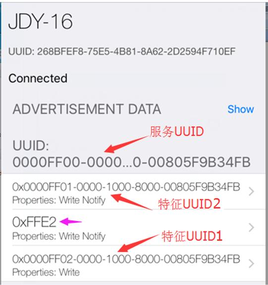
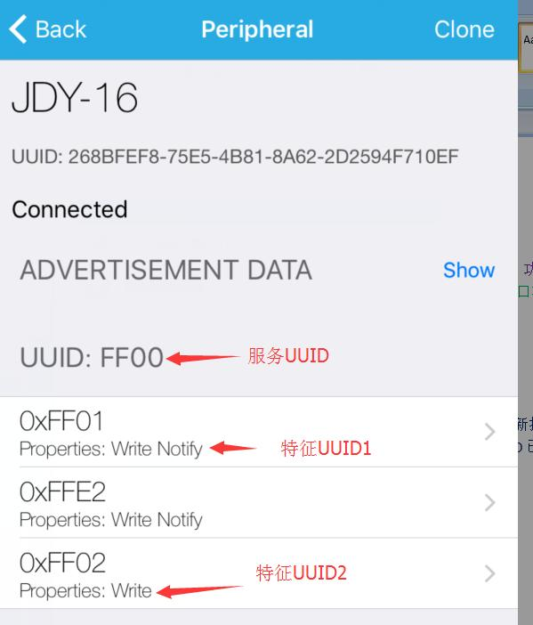

# JDY-16 UUID Configuration

# Table of contents

## 128 bit change method
### Example 1:
Bluetooth service UUID：0000ff00-0000-1000-8000-00805f9b34fb

Features UUID

Low power Bluetooth uses a unified UUID to read and write operations, APP write data to the Bluetooth device by using the write channel, UUID1 is 0000ff02-0000-1000-8000-00805f9b34fb，APP access data from Bluetooth device by using notification channel, UUID2 is 0000ff01-0000-1000-8000-00805f9b34fb

The AT instructions needed to configure the above 128 bit UUID are as follows:
1. Send AT+UUIDLEN1 // Indicates enable 128 bit UUID
2. Send service UUID, send instructions in sixteen decimal format as follows:
	AT+SVRUUID0x0000FF0000001000800000805F9B34FB
	41 54 2B 53 56 52 55 55 49 44 00 00 ff 00 00 00 10 00 80 00 00 80 5f 9b 34 fb 0d 0a
3. Configuration features UUID1, send instructions in sixteen decimal format as follows:
	AT+CHRUUID0x0000FF0200001000800000805F9B34FB

	41 54 2B 43 48 52 55 55 49 44 00 00 ff 02 00 00 10 00 80 00 00 80 5f 9b 34 fb 0d 0a
4. Configuration features UUID2, send instructions in sixteen decimal format as follows:
	AT+CRXUUID0x0000FF0100001000800000805F9B34FB
	41 54 2B 43 52 58 55 55 49 44 00 00 ff 01 00 00 10 00 80 00 00 80 5f 9b 34 fb 0d 0a
5. AT+RST reset mode, Android mobile phone does not need to reopen Bluetooth, and IOS mobile phone needs to reopen Bluetooth.

Using the [Lightblue search](https://play.google.com/store/apps/details?id=com.punchthrough.lightblueexplorer), the UUID of the Bluetooth module has been changed, which requires UUID.



The following is an example of 16 bit UUID configuration.

## Example 2：
Requirement: service UUID is: FF00, **feature UUID1 is: FF01, function is APP receiving serial data**.
*The feature UUID2 is FF02, and the function is to write data to the module serial port by APP*.

The above requirements send AT instructions as follows,
```
AT+SVRUUIDFF00 //Change service UUID
AT+CHRUUIDFF01 //Change feature UUID1
AT+CRXUUIDFF02 //Change feature UUID2
AT+RST // reset mode
```
Android mobile phone does not need to reopen Bluetooth, and IOS mobile phone needs to reopen Bluetooth.

Using the [Lightblue search](https://play.google.com/store/apps/details?id=com.punchthrough.lightblueexplorer), the UUID of the Bluetooth module has been changed, which requires UUID.



## Example 3:
Requirements: service UUID: FF00, **The feature UUID1 is: FF01, the function is APP to receive the serial port data, and it can also write data to the module serial port through this UUID**.

The above requirements send AT instructions as follows,
```
AT+SVRUUIDFF00 // Change service UUID
AT+CHRUUIDFF01 // Change feature UUID1
AT+RST // reset mode
```
Android mobile phone does not need to reopen Bluetooth, and IOS mobile phone needs to reopen Bluetooth.

Using the [Lightblue search](https://play.google.com/store/apps/details?id=com.punchthrough.lightblueexplorer), the UUID of the Bluetooth module has been changed, which requires UUID.
