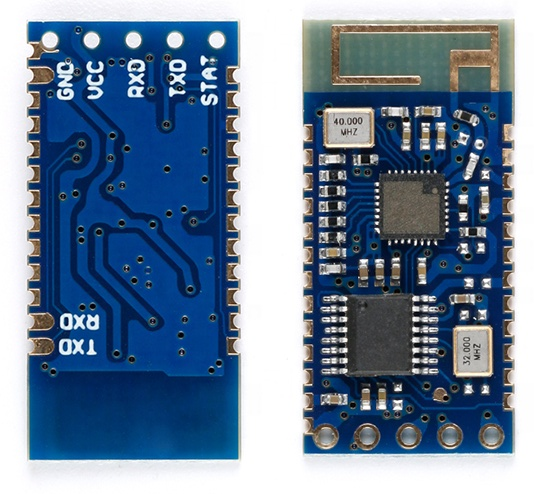
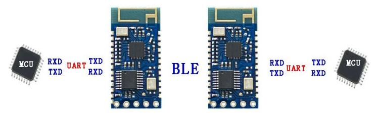
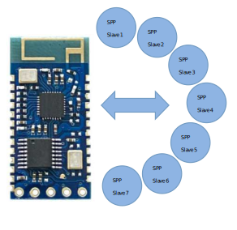
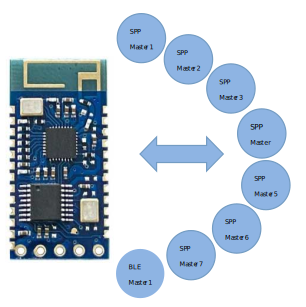

# JDY-34 High Speed Dual-mode Bluetooth Module

# Version
| Version |    Date    | Instruction                                                                                                           |
|:-------:|------------|-----------------------------------------------------------------------------------------------------------------------|
|   1.2   | 2020-04-22 | Released version                                                                                                      |

[Table of contents](#table-of-contents)

# Table of contents
- [1. Product brief introduction](#1-product-brief-introduction)
- [2. Product application](#2-product-application)
	- [2.1 Module communicates with mobile APP or applet](#21-module-communicates-with-mobile-app-or-applet)
	- [2.2 Module and module SPPmaster-slave communication](#22-module-and-module-sppmaster-slave-communication)
	- [2.3 SPPmulti-connected master, connecting 7 SPP slaves](#23-sppmulti-connected-master-connecting-7-spp-slaves)
	- [2.4 SPP slave multi-connected mode supports simultaneous connection of 8 masters](#24-spp-slave-multi-connected-mode-supports-simultaneous-connection-of-8-masters)
- [3. Module parameter details](#3-module-parameter-details)
	- [Module parameter](#module-parameter)
	- [FAQ (Frequently asked question)](#faq-frequently-asked-question)
		- [Q1. How to disconnect Bluetooth from MCU in connection state?](#q1-how-to-disconnect-bluetooth-from-mcu-in-connection-state)
		- [Q2. How much data can serial port write at one time?](#q2-how-much-data-can-serial-port-write-at-one-time)
		- [Q3. What is the fastest communication rate?](#q3-what-is-the-fastest-communication-rate)
		- [Q4. There is no instruction to configure SPP master in the manual.](#q4-there-is-no-instruction-to-configure-spp-master-in-the-manual)
		- [Q5. How to get into deep sleep?](#q5-how-to-get-into-deep-sleep)
		- [Q6. Why can't it multi-connected by default?](#q6-why-cant-it-multi-connected-by-default)
		- [Q7. Is the serial port baud rate still the default baud rate when SPP's high-speed 40kByte/S is verified?](#q7-is-the-serial-port-baud-rate-still-the-default-baud-rate-when-spps-high-speed-40kbytes-is-verified)
	- [Factory common default parameter configuration](#factory-common-default-parameter-configuration)
	- [Pin definition](#pin-definition)
	- [Pin function description](#pin-function-description)
	- [Size and specification](#size-and-specification)
- [4. Serial port AT instruction set](#4-serial-port-at-instruction-set)
- [5. AT instruction function description](#5-at-instruction-function-description)
	- [Test instruction](#test-instruction)
	- [Settings / Queries - Mode work configuration](#settings--queries---mode-work-configuration)
	- [Queries - Version number](#queries---version-number)
	- [Soft reset](#soft-reset)
	- [Restore factory configuration (revert to factory default configuration parameter)](#restore-factory-configuration-revert-to-factory-default-configuration-parameter)
	- [Settings / Queries - Serial port status output enable](#settings--queries---serial-port-status-output-enable)
	- [Settings / Queries - Baud rate](#settings--queries---baud-rate)

## 1. Product brief introduction
The JDY-34 transparent transmission module is based on Bluetooth BLE 4.2 protocol + 3.0 standard, which supports BLE and SPP working at the same time, and SPP supports multi connection and SPP master-slave working at the same time, and does not need to be separately configured as a master or slave function. In the multi-connected mode, SPP supports 7 master-slaves (Android or computer) to connect with 1 IOS mobile phone, and BLE also supports Android or IOS connection. In the master mode, it supports the connection and communication with all SPP slaves on the market, including JDY-30, JDY-31, JDY-32, JDY-33, printer, etc. The communication interface is standard UART, which can configure parameters such as working mode, baud rate, BLE Bluetooth UUID and pairing password through AT instruction. **The main advantage is high-speed communication. SPP supports data transmission and multi connection of 40kbyte per second after connecting with mobile phone or computer.**

[TOC](#table-of-contents)

## 2. Product application
### 2.1 Module communicates with mobile APP or applet
 kB means kByte")

Module communicates with mobile phone orWeChat (applet or official account) kB means kByte

[TOC](#table-of-contents)

### 2.2 Module and module SPPmaster-slave communication

SPPmaster-slave communication

When JDY-34 is used as the SPP master, it supports connecting all SPP slave Bluetooth modules on the market, so JDY-30, JDY-31, JDY-32 and JDY-33 can be used as the slave of JDY-34.

[TOC](#table-of-contents)

### 2.3 SPPmulti-connected master, connecting 7 SPP slaves

SPP Multi-connected master

[TOC](#table-of-contents)

### 2.4 SPP slave multi-connected mode supports simultaneous connection of 8 masters

Multi-connected slave supports 7 Android phones connected with 1 iOS phone, or 7 computers connected with 1 iOS phone.

[TOC](#table-of-contents)

## 3. Module parameter details
### Module parameter
**JDY-34 product parameters**
| Parameter                     | Description                                                                                      |
|-------------------------------|--------------------------------------------------------------------------------------------------|
| Model                         | JDY-34                                                                                           |
| Antenna                       | Built in PCB antenna                                                                             |
| Working frequency band        | 2.4G                                                                                             |
| Transmit power                | 4dB (Max)                                                                                        |
| Communication interface       | UART                                                                                             |
| Working voltage               | 2.1V – 3.6V                                                                                      |
| Working temperature           | -40ºC - 80ºC                                                                                     |
| Receiving sensitivity         | -91dBm                                                                                           |
| Transmission distance         | 40 meters                                                                                        |
| Module size                   | 27mm * 12.88mm * 1.8mm                                                                           |
| Bluetooth version             | BLE 4.2 + SPP dual-mode (Downward compatible 4.2, 4.0, 3.0, 2.1, 2.0)                            |
| Transparent transmission rate | BLE 14k Byte/s  SPP 40kByte/s (Measured speed of 40k byte/s on Android or computer Bluetooth) |
| Instruction parameter saving  | Parameter configuration power down data is saved                                                 |
| STM welding temperature       | < 260ºC                                                                                          |
| Working current               | 15mA                                                                                             |

[TOC](#table-of-contents)

### FAQ (Frequently asked question)
#### Q1. How to disconnect Bluetooth from MCU in connection state?
In the connection state, pull down the PWRC pin, and the serial port sends AT+DISC to disconnect.

#### Q2. How much data can serial port write at one time?
No byte limit

#### Q3. What is the fastest communication rate?
The actual test speed of SPP and computer or mobile phone is 40kByte/s
The actual test communication speed of BLE and iOS mobile phones is 14kByte/s

#### Q4. There is no instruction to configure SPP master in the manual.
SPP is master and slave simultaneous work, and do not need to be configured separately

#### Q5. How to get into deep sleep?
Recommended power-off mode

#### Q6. Why can't it multi-connected by default?
The default is AT+BTMOED1 mode, which is an alternative single connected mode. For multi-connection, please configure AT+BTMODE0 mode.

#### Q7. Is the serial port baud rate still the default baud rate when SPP's high-speed 40kByte/S is verified?
Please use 1M or 750000 or 600000 baud rate setting.

[TOC](#table-of-contents)

### Factory common default parameter configuration

|  #  | Function                 | Factory default parameters            | Instruction                                       |
|----:|--------------------------|---------------------------------------|---------------------------------------------------|
|   1 | Serial port baud rate    | 9600                                  | **AT+BAUD4**                                      |
|   2 | SPP broadcast name       | JDY-34-SPP                            | **AT+NAMEJDY-34-SPP**                             |
|   3 | BLE broadcast name       | JDY-34-BLE                            | **AT+NAMBJDY-34-BLE**                             |
|   4 | Working mode             | SPP (master-slave) or BLE alternative | **AT+BTMODE1**                                    |
|   5 | Output status            | Output status                         | **AT+ENLOG1**                                     |
|   6 | BLE 16 bit service UUID  | 0xFFE0                                | **AT+SVR16UUIDFFE0**                              |
|   7 | BLE 16 bit feature UUID  | 0xFFE1                                | **AT+RX16UUIDFFE1**                               |
|   8 | BLE 16 bit feature UUID  | 0xFFE2                                | **AT+TX16UUIDFFE2**                               |
|   9 | BLE 128 bit service UUID | 0xE7810A7173AE499D8C15FAA9AEF0C3F2    | **AT+SVR128UUIDE7810A7173AE499D8C15FAA9AEF0C3F2** |
|  10 | BLE 128 bit feature UUID | 0xBEF8D6C99C21499D8C15FAA9AEF0C3F2    | **AT+TRX128UUIDBEF8D6C99C21499D8C15FAA9AEF0C3F2** |

[TOC](#table-of-contents)

### Pin definition
 

[TOC](#table-of-contents)

### Pin function description
|Pin | Function  | Description                                                                                                                                                                                                                      |
|---:|-----------|----------------------------------------------------------------------------------------------------------------------------------------------------------------------------------------------------------------------------------|
|  1 | TXD       | Serial port output pin (TTL level)                                                                                                                                                                                               |
|  2 | RXD       | Serial port receive pin (TTL level)                                                                                                                                                                                              |
|  3 | NC        |                                                                                                                                                                                                                                  |
|  4 | NC        |                                                                                                                                                                                                                                  |
|  5 | NC        |                                                                                                                                                                                                                                  |
|  6 | NC        |                                                                                                                                                                                                                                  |
|  7 | NC        |                                                                                                                                                                                                                                  |
|  8 | NC        |                                                                                                                                                                                                                                  |
|  9 | NC        |                                                                                                                                                                                                                                  |
| 10 | NC        |                                                                                                                                                                                                                                  |
| 11 | NC        |                                                                                                                                                                                                                                  |
| 12 | VCC       | Power supply (2.1 - 3.6V)                                                                                                                                                                                                        |
| 13 | GND       | Power ground                                                                                                                                                                                                                     |
| 14 | PWRC      | When it is necessary to send AT instruction in connected state, it can indicate AT instruction mode by keeping this pin low level. In the unconnected state, this pin is in AT instruction mode regardless of high or low level. |
| 15 | NC        |                                                                                                                                                                                                                                  |
| 16 | STAT      | Low level not connected, high level after connection. **Stat pin needs to be added with a diode to MCU**                                                                                                                         |
| 17 | NC        |                                                                                                                                                                                                                                  |
| 18 | NC        |                                                                                                                                                                                                                                  |
| 19 | NC        |                                                                                                                                                                                                                                  |
| 20 | NC        |                                                                                                                                                                                                                                  |
| 21 | NC        |                                                                                                                                                                                                                                  |
| 22 | NC        |                                                                                                                                                                                                                                  |
| 23 | NC        |                                                                                                                                                                                                                                  |
| 24 | NC        |                                                                                                                                                                                                                                  |
| 25 | NC        |                                                                                                                                                                                                                                  |

[TOC](#table-of-contents)

### Size and specification
It is enclosed in the data PCB file, which is 99SE version.

[TOC](#table-of-contents)

## 4. Serial port AT instruction set
:warning: JDY-34 module serial port send AT instruction must add \r\n, AT does distinguish case

| No | Instruction   | Function                                                     | Master / Slave | Default                          |
|----|---------------|--------------------------------------------------------------|:--------------:|----------------------------------|
|  1 | AT            | Test                                                         |       M/S      |                                  |
|  2 | AT+BTMODE     | Setting Bluetooth working mode                               |       M/S      | 1                                |
|  3 | AT+VERSION    | Query version No.                                            |       M/S      |                                  |
|  4 | AT+RESET      | Soft reset                                                   |       M/S      |                                  |
|  5 | AT+DEFAULT    | Restore factory configuration                                |       M/S      |                                  |
|  6 | AT+ENLOG      | Serial port output information shielding switch              |       M/S      | 1 (On)                           |
|  7 | AT+BAUD       | Serial port baud rate setting                                |       M/S      | 4 (9600)                         |
|  8 | AT+PARITY     | Serial port parity bit setting                               |       M/S      | 0 (No parity)                    |
|  9 | AT+PIN        | SPP connection password settings                             |       M/S      | 1234                             |
| 10 | AT+TYPE       | Connect password switch                                      |       M/S      | 0 (Off)                          |
| 11 | AT+NAMB       | BLE broadcast name setting                                   |        S       | JDY-34-BLE                       |
| 12 | AT+NAME       | SPP broadcast name setting                                   |        S       | JDY-34-SPP                       |
| 13 | AT+INQ        | SPP master search slave                                      |        M       |                                  |
| 14 | AT+SINQ       | SPP master stop search                                       |        M       |                                  |
| 15 | AT+CONA       | SPP master connect slave MAC address                         |        M       |                                  |
| 16 | AT+LADDR      | Query or setting module MAC address                          |       M/S      |                                  |
| 17 | AT+DISC       | Disconnect SPP or BLE                                        |       M/S      |                                  |
| 18 | AT+STAT       | Query connection status                                      |       M/S      |                                  |
| 19 | AT+MTU        | SPP compatible low speed channel switch                      |       M/S      | 0                                |
| 20 | AT+AUTEN      | Automatic response on in multi-connected state               |        S       | 0                                |
| 21 | AT+SENDID     | Setting of multi-connected transparent transmission channels |                | 0                                |
| 22 | AT+CIDEN      | Point to first device when multi-connected                   |        S       | 0                                |
| 23 | AT+DATA       | At instruction specifies device to send data                 |       M/S      |                                  |
| 24 | AT+SVR16UUID  | Setting 16 bit service UUID parameter                        |        S       | FFE0                             |
| 25 | AT+RX16UUID   | Setting 16 bit feature UUID parameter                        |        S       | FFE1                             |
| 26 | AT+TX16UUID   | Setting 16 bit feature UUID parameter                        |        S       | FFE2                             |
| 27 | AT+SVR128UUID | Setting 128 bit service UUID parameter                       |        S       | E7810A7173AE499D8C15FAA9AEF0C3F2 |
| 28 | AT+TRX128UUID | Setting 128 bit feature UUID parameter                       |        S       | BEF8D6C99C21499D8C15FAA9AEF0C3F2 |
| 29 | AT+BATT       | Setting BLE service battery service capacity                 |        S       | 100                              |

[TOC](#table-of-contents)

## 5. AT instruction function description
**Special note: MCU sending AT instruction needs to end up with \r\n. The serial port tool sending AT instruction does not need to end up with \r\n. For serial port tools, please check "Sending enter".**

### Test instruction
| Instruction     | Response       | Parameter |
|-----------------|----------------|-----------|
| AT              | +OK            | None      |

**Example:**
> **AT** \
> +OK

[TOC](#table-of-contents)

### Settings / Queries - Mode work configuration
| Instruction       | Response         | Parameter                  |
|-------------------|------------------|----------------------------|
| AT+BTMODE\<Param> | +OK              | Param (0-4)  Default: 1 |
| AT+BTMODE         | +BTMODE=\<Param> |                            |

**Param:**
| Value | Description                                                               |
|:-----:|---------------------------------------------------------------------------|
|   0   | SPP (Multi-connected slave) and BLE slave                                 |
|   1   | SPP (Master slave) or BLE alternative                                     |
|   2   | SPP (Multi-connected master) without BLE function                         |
|   3   | SPP (Master slave SPP single connection alternative) without BLE function |
|   4   | Single BLE slave, without SPP function                                    |

**Special note: Factory AT+BTMODE1 mode, and the printer is connected to multi-connected slave, please select AT+BTMODE0 mode.**

**Example:**
> **AT+BTMODE** \
> +BTMODE=0 \
> **AT+BTMODE1** \
> +OK

[TOC](#table-of-contents)

### Queries - Version number
| Instruction | Response              | Parameter |
|-------------|-----------------------|-----------|
| AT+VERSION  | +JDY-34-SPP-BLE-V1.52 | None      |

**Example:**
> **AT+VERSION** \
> +JDY-34-SPP-BLE-V1.52

[TOC](#table-of-contents)

### Soft reset
| Instruction     | Response       | Parameter |
|-----------------|----------------|-----------|
| AT+RESET        | +OK            | None      |

**Example:**
> **AT+RESET** \
> +OK

[TOC](#table-of-contents)

### Restore factory configuration (revert to factory default configuration parameter)
| Instruction     | Response       | Parameter          |
|-----------------|----------------|--------------------|
| AT+DEFAULT      | +OK            | None               |

**Example:**
> **AT+DEFAULT** \
> +OK

[TOC](#table-of-contents)

### Settings / Queries - Serial port status output enable
| Instruction       | Response         | Parameter                  |
|-------------------|------------------|----------------------------|
| AT+ENLOG\<Param>  | +OK              | Param (0-1)  Default: 1 |
| AT+ENLOG          | +ENLOG=\<Param>  |                            |

**Param:**
| Value | Description                                                               |
|:-----:|---------------------------------------------------------------------------|
|   0   | Close serial port status output                                           |
|   1   | Open serial port status output                                            |

**Special note: When you need to turn on the machine and do not print the information such as +START=OK, +CONNECTED-ID=0, +DISCONNECTED-ID=0, please configure AT+ENLOG to 0.**

**Example:**
> **AT+ENLOG** \
> +ENLOG=0 \
> **AT+ENLOG1** \
> +OK

[TOC](#table-of-contents)

### Settings / Queries - Baud rate
:warning: **Note: the default baud rate of the module is: 115200**
| Instruction     | Response       | Parameter                  |
|-----------------|----------------|----------------------------|
| AT+BAUD\<Param> | +OK            | Param (1-F)  Default: 4 |
| AT+BAUD         | +BAUD=\<Param> |                            |

**Param:**
| Value | Baud rate |
|:-----:|----------:|
|   1   |      1200 |
|   2   |      2400 |
|   3   |      4800 |
|   4   |      9600 |
|   5   |     19200 |
|   6   |     38400 |
|   7   |     57600 |
|   8   |    115200 |
|   9   |    128000 |
|   A   |    230400 |
|   B   |    256000 |
|   C   |    460800 |
|   D   |    600000 |
|   E   |    750000 |
|   F   |   1000000 |

**Note: High speed baud rate is required for high speed communication.**

**Example:**
> **AT+BAUD** \
> +BAUD=4 \
> **AT+BAUD4** \
> +OK

[TOC](#table-of-contents)

